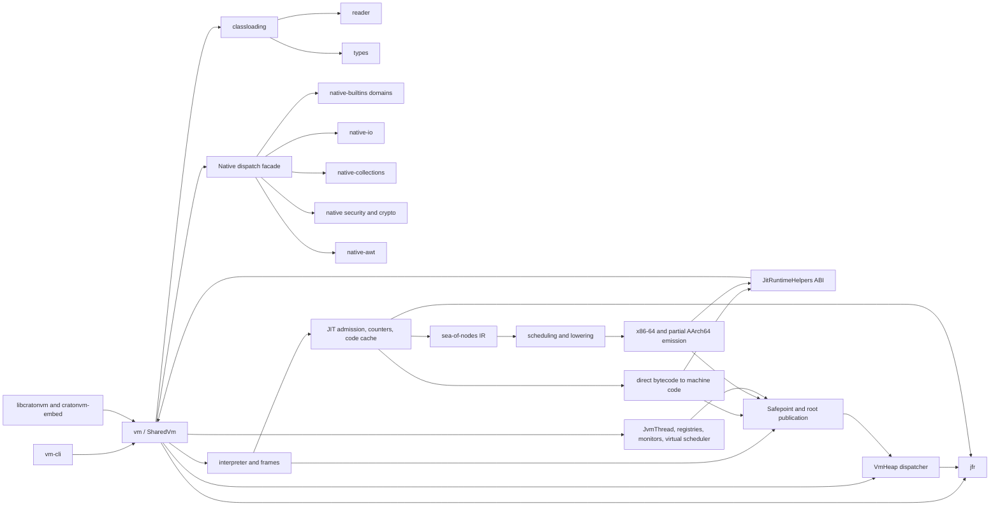
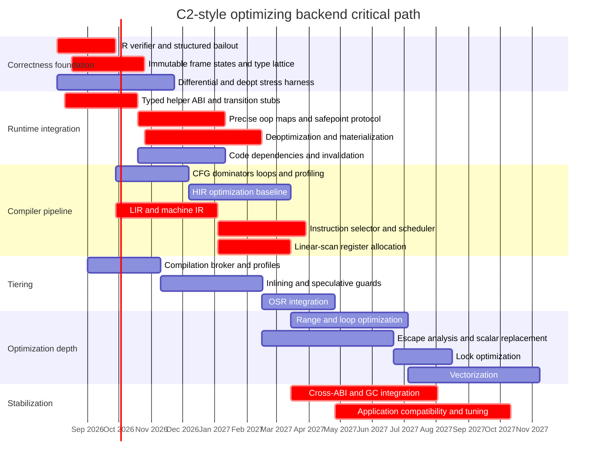
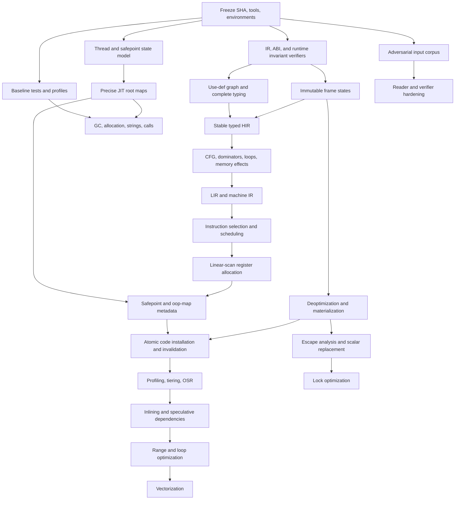

# CratonVM Code Review: Prioritized Parallel TODO Plan

> ## Remediation status — 2026-08-01, branch `feat/c2-review-remediation`
>
> Implemented by two waves of parallel agent lanes: **64 non-merge commits,
> 211 files** against `origin/dev`, 36 of those commits in the second wave.
> `evidence/` is produced by `scripts/evidence/collect.sh` (P0 step 1). No test
> or check counts are restated here — none was run when this banner was written,
> and the earlier banner's figures are stale.
>
> **Read this first: the report's premises were not all correct.** Every lane
> was told to verify before acting. Roughly one premise in three did not hold:
>
> | Report claim | Finding |
> |---|---|
> | Certification-path validation is absent | Present — per-link verification, anchor matching, validity windows, BasicConstraints, KeyUsage, EKU. Name constraints are not a silent skip either: the extension is absent from the recognised-critical set and any unrecognised critical extension is refused, and RFC 5280 requires it critical. Genuinely missing: revocation, and multi-`SignerInfo` — the parser takes the first and reports nothing. (`09d26d746`) |
> | SATB pre-write barrier may have a JIT blind spot | It does not; the JIT emits a real SATB pre-barrier. The blind spot was in the *post*-write barrier (see G1-1 below). |
> | `JitRuntimeHelpers` has ~46 fields | 58 fields / 464 bytes at the time; 62 / 496 now, after the monitor helpers were appended as fields 60–61. |
> | Fix the `nio_file` opener list (7 sites) | 10 sites; two were spelled inside `.or_else(..)` and one whole `RandomAccessFile` overload was missed. |
> | The JIT bakes each helper slot's **byte offset** into RWX code as `CALL [helpers + disp32]`, so a struct reorder mis-targets a call | **False — and the claim came from the module's own doc.** The compiler holds the table by value or reference and reads slots by Rust field name; `emit_call_absolute` bakes the helper's *absolute* address. Grepping `jit/` and `vm/` for a helpers pointer, an `offset_of!` on the struct, or a `[helpers + ..]` addressing form returns nothing. That false claim was hiding the real hazard, which is the **signature**: the backend loads N argument registers by hand and jumps to a bare address, and nothing tied that to the callee's declared arity, widths, or whether it returns. Closed with `HELPER_FN_SIGS`, 62 literal `GOLDEN_HELPER_OFFSETS` rows (the only check a *coordinated* reorder cannot satisfy), and an armed runtime validator — which had zero callers outside its own crate. (`da7154ab8`) |
> | 74 undeclared flags, one of them weakening a security control | The count is **not reproducible as stated** — no enumeration exists in the tree, and the guard's own docs said 63 when it was written. The guard had **27** offenders; 26 were declared and it now has 0. The security-relevant one is real: `CRATONVM_SHADOW_NO_END_GUARD` suppresses the shadow-stack overflow guard both backends emit, i.e. deliberately restores an out-of-bounds write as a bisection aid, and undeclared it was invisible to the launcher, to `-XX:` and to test overrides. Two requested rows were refused for having no consumer at all. (`b24eee75d`) |
> | The aarch64 backend diverges from x64 on write barriers, SATB, inline caches, deopt metadata and implicit null checks | It has **no object model at all** — it refuses every field, array, allocation, dispatch, type-check, monitor and athrow opcode, and `emit_invoke` fails unconditionally. Several census rows are therefore **N/A by construction, not divergent**; the G1 `GC_FLAG_OLD_GEN` hazard has no aarch64 analogue. (`8f2c76db4`) |
> | Range analysis is absent | Not absent. `scev.rs` already carried an int interval lattice with an explicit `OverflowModel`, and `bce.rs` already had a range-backed section; the doc's Status line claiming otherwise was stale. Genuinely missing: any range analysis over the sea-of-nodes IR, a 64-bit domain, bitwise/shift/rem/div narrowings, a widening operator, and **non-loop** bounds-check elimination. (`0bc87e3fc`) |
> | A compilation broker must be built | One already existed, landed unfinished with **zero tests**, its own doc comments referencing four tests and a design doc that existed nowhere in the tree. (`44aa4d9a3`) |
> | A monomorphic-looking call site may have overflowed its receiver-type slots | Not for the profile the JIT reads — `MethodProfile::record_receiver` inserts into an uncapped map. True only of the unwired `pgo::ReceiverTypeProfile` (`MAX_ENTRIES = 8`). (`0eb3439cb`) |
> | `fuzz/` has 18 libfuzzer targets, not wired into CI | **17**, and they *are* wired: `fuzz-smoke` in `.github/workflows/ci.yml` is a blocking job that builds all 17 on every commit. 6 of 17 had a seed corpus. (`d0abf2324`) |
> | `jit/src/x64/isel.rs` is an instruction-selection pass that needs extending | It **had never been compiled**. No `mod isel;` existed anywhere in the crate, so a 3,941-line pattern table and its ~1,480 lines of tests had never been seen by a compiler. It is also not an IR-level matcher: it operates on operands that are already registers. (`db64b3dfe`) |
>
> **Now wired — the four deep integration items, plus one that had never been
> compiled.** An earlier banner listed all of these as analysis-only. That is no
> longer true; the exact state of each:
>
> - **Lock elision/coarsening — wired end to end.** `IrBuilder` emits
>   `MonitorEnter`/`MonitorExit` advancing the memory token (both are JMM
>   acquire/release barriers and safepoints), and `ir_lower` emits the helper call
>   through the pre-existing `runtime_lowering::emit_monitor_stub`. The safepoint
>   map is published before `alloc_slot` (the `Op::Call` contract), and the
>   helper's remapped return is stored back over the object's slot — idempotent
>   with the collector's own rewrite, because `remap_one_jit_frame` keys on the
>   slot's *current* value. It still refuses when the helper table has no monitor
>   entry: a backend that cannot lower these must decline the method rather than
>   emit nothing and drop the lock. Separately, a monitor-bearing graph is refused
>   **precise deopt resume** — every `FrameState` this lowerer builds hard-codes
>   `monitors: Vec::new()`, which *defeats* the interpreter sink's
>   holds-a-monitor guard rather than tripping it; such methods fall back to the
>   whole-method re-run. (`833ae0310`, `dfe49f921`, `0f07ab7db`)
> - **Loop rewriter → bytecode — wired, atomically, behind an opt-in.** All 21
>   pc-keyed side tables are replicated in one destructuring `let`, so a 22nd
>   parameter is an arity error rather than a silent miscompile. Fail-closed: a
>   structured refusal falls back to the original bytecode, and a transform with
>   non-empty `deopt_points` discards the method rather than publish an output PC
>   as a resume bci. Armed per thread via `set_bytecode_loop_rewriter_armed`
>   (`jit/src/x64.rs`); off process-wide, no env read, and arming it turns the
>   native unroller off in the same motion. Two of the recorded design premises
>   were wrong: the metadata translation is **not** a post-pass over
>   `CompiledMethod` — the bci is baked as a `MOV R8, imm64` by `emit_deopt_stubs`
>   long before a `CompiledMethod` exists, so it is one accessor
>   (`Compiler::orig_bci`) at 4 sites — and there are **four** bci-baking sites,
>   not three; the fourth is the athrow lowering, which untranslated would have
>   mis-routed `finally` blocks in every rewritten method. `OopMapEntry::bytecode_pc`
>   must *not* be translated. (`6e84a5e12`)
> - **Linear-scan RA — has a production call site.** Behind
>   `CRATONVM_JIT_IR_LINEAR_SCAN`, off by default, `ir_lower` runs the allocator,
>   verifies it, cross-checks it against the slot colourer, and uses the result as
>   a **write-through register read cache**. Every value is still stored to its
>   home word, so `emit_safepoint_map`, `build_deopt_points` and `emit_phi_copies`
>   are untouched and the oop map is byte-identical to the colourer path's. The
>   file is XMM-only because `emit_prologue` saves no callee-saved register, so
>   widening it is a prologue change, not an allocator change. Found on the way
>   in: `regalloc::ir_op_is_call` was **not** a superset of the calls `ir_lower`
>   emits — it emits a returning CALL for FP `Op::Rem`, `Op::Load` and `Op::Store`,
>   so with a caller-saved file a value held across any of them was silent wrong
>   code; and the allocator was **inert on every real method**, because
>   `IrBuilder` pushes a safepoint snapshot at every bci and the live model pinned
>   essentially the whole value set. `spills`/`reloads` are now measured on this
>   path and count what was *emitted*; the colourer path stays `NotMeasured`
>   rather than report a zero it cannot justify. (`39d5b1426`)
> - **Vectorization — the emitter exists, with no call site, deliberately.**
>   `jit/src/x64/vec_emit.rs` exposes `emit_vector_loop` and a test harness;
>   nothing calls it, because its call site lives in `x64.rs`, owned by a
>   different lane that wave. Fail-closed at both the entry point and the opcode
>   selectors, so bypassing the entry point does not help: reference elements (a
>   vector store of oops bypasses the write barrier — the same family as the G1
>   UAF below), byte/char/short, int div/rem, FP min/max, long multiply, and/mul
>   reductions, *all* FP reductions, strict-alignment ISAs, non-AVX2 hosts, and
>   register spilling. VEX encodings were cross-checked byte-for-byte against the
>   already-shipping emitters. Three documented prerequisites before it may be
>   wired: unify the XMM0–5 pool with `regalloc.rs` or a scalar FP value living
>   there is silently destroyed; patch every `fallback_sites` rel32 at the caller;
>   give the vector loop a back-edge safepoint poll. (`e734be64e`)
> - **`jit/src/x64/isel.rs` is compiled for the first time.** Adding
>   `pub mod isel;` put a 3,941-line pattern table and ~1,480 lines of tests in
>   front of a compiler — including the byte-for-byte equivalence sweep against
>   the hand-written emitters, which is the *entire* basis for trusting the table
>   and had never run. 68 of 68 isel tests pass; the first run found a real
>   cost-model tie-break bug (`p + 24` selected an LEA). An existing doc listed
>   adding that line as a prerequisite "before wave 1"; it was never done. A
>   genuine IR-level tiler and a memory-order validator for the scheduler landed
>   alongside it, with no unanchored pattern rows — every row names the
>   hand-written code it reproduces byte-for-byte. (`db64b3dfe`, `13f3b5a46`)
>
> **Defects found that this report does not describe.** These were the campaign's
> highest-value output and are unrelated to the roadmap items that surfaced them.
> Wave 1:
>
> - **G1 never stamped `GC_FLAG_OLD_GEN` on promotion**, so the JIT inline
>   reference store read every promoted object as young and skipped the
>   remembered-set barrier. The rset rebuild repairs this only for the *next*
>   pause — a use-after-free in the current one.
> - **`jit_tlab_skip_offsets` published overlapping spans** while both consumers
>   required ascending+disjoint, letting the sweep cursor resync twice and
>   swallow every object between them.
> - **Escape analysis folded a field load to a later store's value**
>   (`int a = o.x; o.x = 42;` yielded `a == 42`): it records only the last store
>   per field but forwarded every replaced load to it.
> - **`SSLServerSocketFactory.createServerSocket()` returned a plaintext socket**,
>   inheriting the abstract base's working cleartext body.
> - **VM shutdown mid-GPU-submission wedged the collector permanently** — the
>   critical counter stuck at >=1 for the life of the process.
> - **`RedefineClasses` silently did nothing in any second VM** (a single
>   `Weak<SharedVm>`), breaking sequential embedding, not just concurrency.
> - **The new IR verifier poisoned its own pipeline**: a stub graph from an
>   abandoned build set a sticky bail that dropped a later *successful* build
>   out of the optimizing tier. Found only by running the tests.
>
> Wave 2, each verified from the commit that closed it:
>
> - **Use-after-free in the concurrent old-gen sweep** (GCAUD-4). `concurrent_sweep`
>   is the only phase of the concurrent old cycle that runs outside STW, and its
>   liveness test is two tables keyed on a bare old-gen address. Between remark and
>   the sweep's lock acquisition, another thread's young GC can run `old_gen_gc`;
>   the in-place arm frees blocks and the next promotion **re-issues those
>   addresses** to new live objects. Such an object satisfies both halves of the
>   TAMS filter — "existed at remark" (its address did) and "bit clear" (the bit
>   describes its predecessor) — and is freed while live. Closed with an old-gen
>   reclaim epoch: a mismatched snapshot reclaims nothing. (`071afa11e`)
> - **The compactor manufactures a dangling pointer** (GCAUD-2). Phase 0 assumes
>   the object walk yields every old-gen object, but a freed block is invisible to
>   it — allocated extents are the *gaps* between free blocks. For such a referent,
>   phase 0 OR-ed the mark bit into an unvalidated address, phase 1 gave it no
>   forwarding address, and phase 3 slid a different object onto it. It now refuses
>   the write and abandons the whole compaction. (`071afa11e`)
> - **A ChaCha/Salsa round count of zero made the permutation the identity.** The
>   previous wave's guard checked **parity only**; BouncyCastle's own constructor
>   rejects `rounds <= 0 || (rounds & 1) != 0`. With zero rounds the core emits
>   `x[i] = 2 * input[i]` — a "keystream" that is an invertible function of the
>   engine state, and the engine state *is* the key. That makes the SPHINCS hash
>   forgeable. Zero is reachable because the round count is read **by name**, and a
>   by-name read of an unwritten int slot yields `Int(0)`. Same commit: the sunec
>   non-canonical-scalar branch answered *every* `s >= n` with the identity — a
>   plausible, well-formed point, on a private-key operand. (`09d26d746`)
> - **Every JIT dispatch memo was keyed on an address identical in every VM.** Six
>   **process-global** `static JitInvokeInfo`s are passed as `info_ptr` to
>   `jit_invoke_dispatch`, so that address is the same in every VM — a guaranteed
>   collision, not a recycling hazard. The partial mitigation that existed was
>   insufficient: two caches were flushed only because a second VM's bootstrap
>   accidentally over-flushed process-global generation counters, and the object and
>   integer native dispatch caches had no `clear()` anywhere in the file.
>   `class_init_memo` and `system_class_memo` were unqualified process-global
>   bitmaps indexed by raw `ClassId` and consulted from `jit_getstatic`.
>   (`aa3c737e0`)
> - **The exception table was entirely unvalidated.** `start_pc`, `end_pc`,
>   `handler_pc` and `catch_type` were parsed as four raw `u16`s and stored
>   verbatim, never compared against `code_length` or the constant pool, though
>   JVMS 4.7.3 constrains all four and HotSpot enforces all four. That is
>   exploitable because **`handler_pc` is a jump target**: `jit/src/lib.rs` takes
>   `entry.handler_pc as usize` and feeds it into a code walk, so `0xFFFF` in a
>   4-byte method was an attacker-chosen out-of-range bytecode index handed to code
>   entitled to assume the parser had rejected it. Closed with HotSpot's exact rule
>   set, called from both entry points because `decode_attribute` is `pub` and
>   independently reachable, plus a 2,819-mutant deterministic harness driven past
>   `read_class`. (`a146b78f0`)
> - **Escape analysis deleted the monitors on an object it wrongly believed
>   confined.** `build_connection_graph` had no `Op::Other` arm, and two ops land
>   there while publishing a reference — `LambdaIntToDouble`, which invokes the
>   lambda it is handed, and `Guard`, a deopt point. Scalar replacement was safe by
>   accident (its use walk refuses `Op::Other`), but **lock elision walks no uses at
>   all**: it asks only `get_escape(object).is_confined()`. Two siblings in the same
>   commit, same may-alias-used-as-must-alias shape: a self-referential alias
>   (`o.next = o; Foo p = o.next; p.x = 5`) left a store writing through an
>   `Op::Dead` holder after the allocation was deleted, and DSE deleted a live store
>   on a may-alias key because `MemKind` is an access **width**, not a field index,
>   so `o.x = 1; o.y = 2;` matched. (`3a04f6fdc`)
>
> Also found, same wave, in brief: **six unchecked deopt-metadata invariants, three
> fail-open** — nothing checked frame-slot offsets at all (`off == 0` is `[rbp]`,
> the saved caller FP that `poison_slot` exists to make unnameable), one frame word
> could be `ref` in one slot and `int` in another, a monitor whose object is an
> `Int` passed verification, and `chain_is_resumable` returned `true` for a chain it
> had not finished walking while being consulted by two compile-time admission gates
> (`86b613c3f`); **no publication path had any install-age check**, so a compilation
> could be installed after the redefine or cache flush that invalidated it —
> `CompiledMethod::compilation_epoch` is not that check, it is the debug-gated
> deopt-osr speculation epoch (`66f0b6039`, `da666127a`); **the JIT pending exception
> lived in a `thread_local` `Cell` with no root provider**, neither scan nor remap,
> which TLS cannot have — a root source runs on the collecting thread and cannot see
> a parked peer's TLS, so the storage moved onto `JvmThread` (`f64f14ffa`); **every
> `OscCache` published a raw pointer to its own map into a process-global vector**,
> so every VM's root scan handed its collector other VMs' heap addresses and every
> VM's post-move fixup rewrote other VMs' entries — its own doc recorded 5 SIGSEGVs
> and 2 hangs in 1500 runs (`cb0c0a6f4`); **JVMTI's real-agent bridge was a
> first-writer-wins `OnceLock`** described in-tree as last-writer-wins, so a second
> VM's `-agentpath:` agent received zero bridged events for the life of the process
> (`8ebe8e604`); **`DIRECT_BUFFERS` was keyed on the buffer's raw heap address**,
> never remapped, never swept, and consulted before the field read, so a recycled
> address handed native code the previous buffer's malloc pointer — and it was
> masking a second bug, since the documented "authoritative" fallback reads slot 0 as
> a `Long` which is only correct for the fabricated stub class (`64e6d61b4`); **array
> classes were given the bootstrap loader** contrary to JVMS 5.3.3, live enough that
> two hand-rolled workarounds for it already existed in native-builtins
> (`78a5c3024`); **four unsafe aarch64 rows** — Windows-on-ARM never flushed the
> I-cache, negative FP spill offsets went through the *scaled* unsigned form so
> `-24` became `65512 * 8` and every spilled float read and wrote ~64 KiB above FP
> inside the caller's frame, `ARM64_LOCAL_FPS` is D8–D15 which AAPCS64 makes
> callee-saved while the prologue saved only GPRs, and an unencodable SP adjustment
> emitted `BRK #0` and reported **success** (`8f2c76db4`); **`dominant_receiver`
> overflowed `u32` at ~43M observations at one call site** — the function that seeds
> the inline caches — and its `max_by_key` tie-break over an `FxHashMap` made two
> compiles of one profile seed different caches (`0eb3439cb`); and **two native
> shims on abstract classes that intercept every subclass**, one of which
> (`AbstractMap.hashCode`) returned the receiver's **raw heap address**, which moves
> under a moving young collection (`585787262`).
>
> **Deliberate behaviour changes, for anyone measuring.**
> Allocation elision no longer fires for allocations named by a safepoint slot
> (correctness over optimization; recovery documented in `docs/jit/deopt-metadata.md`);
> G1 loses the inline store on the fresh-ctor pattern (`docs/gc/g1-audit.md` §10);
> Panama upcalls without `--enable-native-access` now throw.
> Frame bytes fell 82–97% and the optimizing-tier node ceiling rose 4,086 → 20,000.
> The sharpest one is GCAUD-2's fail-closed response: **while a workload is in the
> state where a live object references a freed old-gen block, major GC reclaims
> nothing** — silent corruption traded for eventual OOM. That is the required
> direction, and `COMPACT_ESCAPE_HITS` is the number that says whether it is
> happening. Guard-dominated BCE landed opt-**out** and was flipped to default-off
> (`CRATONVM_JIT_RANGE_BCE=1` to arm): it is a brand-new reason for *deleting* a
> bounds check, has never been benchmarked or differentially tested, and a wrong
> elision is an out-of-bounds heap write. (`1078030f2`)
>
> **Not validated. Read this literally.**
>
> - **No stress harness, no sanitizer run, no Loom/Shuttle, and no benchmark A/B
>   has ever been run against any of it.** Every performance figure in this banner
>   is a static or emitted-code count, not a measurement.
> - **No fuzzing campaign has ever been run.** 17 targets, every one reaching a real
>   parser, all built by the blocking `fuzz-smoke` CI job on every commit,
>   **executed never** — not one input, no `fuzz/artifacts/` has ever existed, no
>   coverage report exists anywhere in the tree, and no document records a run. All
>   17 now have committed seeds, pinned byte-identical across runs; that is
>   scaffolding around a campaign that has not happened. Biggest uncovered surface,
>   and not on any lane's list: the raw HTTP request parser, which reads straight
>   off a socket and is strictly more attacker-reachable than jimage.
>   (`docs/known-issues/fuzzing-state.md`)
> - **Nothing in the aarch64 work has executed on aarch64 hardware.**
> - **One test is committed `#[ignore]`d because it fails and the failure is real** —
>   `jit/src/x64.rs`, "publishes a live OSR entry at a refused bci". The triage is
>   in the commit: `osr_entry_pc` and `rebuild_pc_to_native` are correct in
>   isolation on that fixture's own plan, the compile under test really is rewritten
>   (the test now proves that before asserting anything), yet the published vector
>   still carries a live entry at bci 16, and forcing the refusal again at
>   publication does not change it. Not reachable in production — the rewriter is
>   off by default and armed per thread — but a live entry at a refused bci is a
>   wrong-code bug either way: entering there resumes a "back edge next" frame at
>   the top of a fresh body and runs one extra iteration. (`e3824ee07`)
> - The generated **197-opcode corpus is compiled, not run**. CI reports the matrix;
>   nothing diffs 197 programs × 7 modes against HotSpot. The `checksum` comparison
>   dimension is *exercisable*, not exercised.
> - Capability enforcement is now **live at runtime but permissive**
>   (`CapabilityMode::Permissive`): `install_capabilities` is called from
>   `SharedVm::new` before the `register_*` pass, so the ~35 per-call-site gates
>   resolve and `capability_audit(vm)` answers — and nothing is denied by default.
>   (`docs/security/capability-runtime-install.md`)
> - The **compilation broker is entirely unwired**, and its class epoch has no
>   producer until the VM's redefine/unload sites call `invalidate`; a missed call
>   site there would be a silent wrong-code hole. Three defects in the *live*
>   manager were reported and deliberately **not** fixed, each being a behaviour
>   change with no flag to gate it: `on_deoptimization`/`on_c2_bailout` clear
>   `queued_for_compilation` without removing the queued task, `enqueue_compilation`
>   deduplicates not at all, and there is no invalidation for a redefined class's
>   queued or in-flight requests. (`44aa4d9a3`)
> - **Inlined deopt scope chains are still not produced.** `push_scope` has no
>   non-test caller anywhere in the workspace, so `FrameState::caller` is `None` in
>   every installed artifact, and the single-pass backend has no scope stack at all.
> - **`DeoptimizationPoint::semantics` is stamped by every producer and read by no
>   consumer** — `vm/src` never inspects the field; the resume sink still infers
>   re-execute-vs-resume from `DeoptReason`.
>
> **Still open — go to the lane doc, not to this banner.** Each lane left a
> document rather than a summary line here.
> `docs/jit/`: `aarch64-parity.md` (32-bit int width is a deliberate non-fix; the
> exact SXTW/shift-mask encodings are recorded), `instruction-selection.md` and
> `instruction-patterns.md` (32-bit LEA refused rather than guessed — the biggest
> missing win, since most Java arithmetic is int), `vectorization-emitter.md` (the
> three wiring prerequisites), `linear-scan-wiring.md`, `loop-rewriter-wiring.md`,
> `compilation-broker.md`, `deopt-inline-scopes.md`, `deopt-metadata-audit.md`,
> `alias-analysis.md` (`Graph::may_alias`/`may_reorder` pinned as the one oracle,
> with its contract and six premises written down), `range-analysis.md`,
> `code-cache-lifecycle.md`.
> `docs/gc/`: `gc-crate-audit.md` (GCAUD-5 **decided, not fixed** — and the earlier
> "degradation only" verdict is corrected there: an un-retired reserved tail of 8,
> 16 or 24 bytes sizes as a zeroed header and the walk strides *into* the next
> object, a desync rather than a precision loss), `old-sweep-liveness.md`,
> `g1-audit.md` (G1-9 parallel young evacuation is **not** confirmed root-caused;
> the flag stays opt-in and mixed GC stays serial), `tlab-and-card-audit.md`.
> `docs/known-issues/`: `classloading-identity-audit.md` (JVMS 5.3.4 loader
> constraints are unimplemented workspace-wide. Two of that doc's open items
> have since been CLOSED without it being updated: `fabricate_class` now refuses
> an ambiguous name instead of minting a stub that outranked both real classes
> (`synthetic-class-fallibility.md`), and an array class now takes its
> component's defining loader per JVMS 5.3.3
> (`array-class-defining-loader.md`). Read it for the residue, not for those),
> `vm-process-global-state.md` and `-round-2.md` (a 467-static / 58-`thread_local`
> census of `vm/src`: ~400 benign, 4 per-VM leaks, 6 dangerous — 2 fixed, 2 already
> correct, 2 open with recipes), `native-builtins-shim-audit.md`,
> `native-collections-root-audit.md`, `crypto-failure-mode-audit.md`,
> `flag-declaration-audit.md`, `fuzzing-state.md`, `class-file-parser-hardening.md`.
>
> **The report's own multi-month lanes remain multi-month lanes.** HIR/LIR/MIR,
> profile-guided inlining, OSR, loop transforms, and the `x64.rs`/`invoke.rs` seam
> splits are untouched in scope; instruction selection, linear-scan RA, range
> analysis, vectorization and the broker now have a first increment each, not a
> finished lane. The report scopes these at 180–360 engineer-days each and the whole
> roadmap at 24–36 months for one engineer, and nothing above changes that.
>
> ---
>
> ### Superseded: the "four deep integration items: exact remaining state" section
>
> That section recorded all four as analysis-complete with no production
> consumer. All four now have one (or, for vectorization, a deliberate
> non-consumer); see **Now wired** above. Two of its recorded conclusions were
> disproved when the work was actually done — the loop-rewriter metadata
> translation is not a `CompiledMethod` post-pass and there are four bci-baking
> sites rather than three — and both corrections are in
> `docs/jit/loop-rewriter-wiring.md`. The rest of the section is preserved only in
> git history (`ee504fdec`, `734a3995f`, `7254f8475`).
>
> One figure from it is worth keeping: the vectorization admission gate still
> admits **11 of 27** corpus loops, and that number was deliberately not moved by
> the emitter work.
>
> ---
>
> ### Earlier wave — landed fixes, CI wiring, doc reconciliation
>
> Kept because these are closures the sections above do not repeat. The unit-test
> count that used to head this section is removed: it was not re-measured.
>
> | Item | What changed |
> |---|---|
> | G1-8 — "undead" remembered-set entry | An rset entry is now `(source, generation)`, not a bare source index. `G1Region::recycled_in_generation` + `rset_cache_epoch`-as-clock make the sharper test available to both the scan side (`live_rset_sources`) and `cleanup` (`retain_sources_in_generation`), so a recycled-**and-retyped** source no longer survives forever. Fail-safe by construction: un-stamped entries get `RSET_GENERATION_PINNED`, and the staleness test is a strict `<`. |
> | T-3 — moving cycle with published TLAB tails | Escalated from a rate-limited warn to a **refusal**: the young collection is skipped (over-retain, spill to old gen, retry). Not a heuristic — the tails are already clipped to this from-space, so a non-empty set *is* the hazard. Expected unreachable on a correct transition graph. Deliberately does **not** divert to the non-moving sweep, which on the precise-root path reclaims live young objects. |
> | `System.setSecurityManager` cross-VM finding (use-after-move) | **Fixed.** Three process-global `(identity_key, ObjectRef)` singletons replaced by a `vm_identity`-keyed index (`SECURITY_STATE`), plus a real GC root source (`"security-manager"` in `vm/src/memory/native_roots.rs`). The keying closes the sandbox-disarm hole; the root source closes the use-after-move — per-VM keying alone would not have. Six tests next to the fix. |
> | Deopt reexecute flag | `DeoptimizationPoint::semantics: ResumeSemantics` landed; **every** producer stamps `ResumeSemantics::for_reason`. The prose convention now lives in one place. |
> | Deopt-metadata verifier | Wired at the **IR** install site (`ir_lower.rs`, before the artifact becomes a `CompiledMethod`), with a dedicated `BailoutReason::DeoptMetadata` and context `phase=install`. |
> | Opcode / execution-path coverage | `gen-opcodes` (197 programs, each with a declared checksum and its focus code inside a loop inside a `try`) + `matrix` (tri-state cells, reconciliation) now run in CI's `difftest-gate` job and upload `opcode-coverage-matrix`. Report, not a gate: exit 0 or the non-fatal exit 3 pass, anything else fails. |
> | Performance gate | `.github/workflows/performance.yml` passed `--reps 5` while the gate's reliability preflight requires `--min-samples 7` — that job would have exited **12 [SAMPLE-COUNT]** before taking a single measurement. Now `--reps 7`. |
>
> **Half-closed, as of this wave.** Inlined deopt scope chains, the reexecute
> flag, the deopt-metadata verifier in the single-pass backend, the uncompiled
> opcode corpus and G1-9 are all still open and are described under **Not
> validated** and **Still open** above. G1-9 specifically: one real
> serial/parallel divergence was found and fixed — the parallel source set
> omitted JIT-pinned regions, reachable **only** as remembered-set sources, and
> it reproduces in the same `--nojit` configuration as the corruption — but it is
> **not confirmed as the root cause**, the flag stays opt-in and mixed GC stays
> serial.
>
> This section previously listed lock elision/coarsening, the vectorization gate,
> linear-scan RA and the bytecode loop rewriter as "complete, tested, and with no
> production consumer at all". **That list is now wrong in every row except
> vectorization** — see **Now wired** above. In particular `IrBuilder` does have
> `monitorenter`/`monitorexit` arms (opcodes `0xc2`/`0xc3` in `jit/src/ir.rs`), so
> the escape-analysis offer lists are no longer empty by construction. The
> vectorization *emitter* exists too; what it lacks is a call site.

## Executive summary

**Evidence boundary and estimation rule:** Treat this report as a static-analysis and repository-history review of the public `main` branch as visible on July 31, 2026. The exact reviewed commit SHA is **unspecified** because a local clone could not be completed in the review environment; the first action below therefore freezes the revision before implementation. Build, test, sanitizer, fuzzing, and profiling results are **not claimed as executed** here. Effort estimates are engineering estimates for one experienced contributor working an eight-hour day, excluding review and CI queue time. Performance impacts are hypotheses that must be accepted only after controlled A/B measurements.

| Priority | Parallel lane | Actionable outcome | Estimated effort | Dependencies | Exit criterion |
|---|---|---|---:|---|---|
| **P0** | Reproducibility | Freeze a commit, toolchains, feature matrix, benchmark host description, and reproducible failure corpus before changing compiler or GC code. | 2–4 days | None | Every review finding links to a commit SHA, command, configuration, and archived output. |
| **P0** | JIT correctness | Add an always-on IR/lowering verifier; replace sentinel locations, compiler panics, unchecked displacement narrowing, and untyped helper addresses with checked, fallible representations. | 15–25 days | Frozen revision | Invalid IR or ABI state causes a deterministic compilation bailout, never silent wrong code, panic, or native crash. |
| **P0** | Threading and GC | Re-audit `ObjectRef` thread-safety, JIT-frame publication, safepoint arrival, blocking-native transitions, cross-thread compiled-frame takeover, pinning, and per-VM global isolation. | 20–35 days | Stress harness; architecture state model | One billion-operation stress runs under sanitizers and forced-GC/deoptimization schedules show no stale references, missed roots, deadlocks, or cross-VM state leakage. |
| **P0** | Security | Complete verifier hardening for adversarial class files; fuzz all binary parsers; gate native/FFI access explicitly; normalize cryptographic and signed-JAR failure behavior; audit all unsafe blocks. | 30–60 days | Fuzz infrastructure | Malformed input cannot reach unchecked execution, executable-memory corruption, unrestricted FFI, or ambiguous security success/failure. |
| **P1** | Architecture | Make interpreter, direct JIT, optimizing JIT, reflection, native invocation, and method-handle paths consume one dispatch and bytecode-semantics contract. | 25–45 days | P0 differential tests | Generated coverage matrix shows one authoritative implementation or a differential test for every supported opcode and call form. |
| **P1** | Compiler performance | Add use-def chains, compact node storage, immutable interned frame states, liveness-based slot reuse, and linear-scan register allocation before adding more high-level optimizations. | 45–80 days | IR verifier | JIT compilation time, generated frame size, loads/stores, and runtime improve without increasing wrong-code or bailout rates. |
| **P1** | Runtime performance | Re-establish trustworthy baselines, then attack allocation/GC, String/Regex, call transitions, object fixed costs, and redundant map/look-up work in that order. | 30–70 days | Reproducibility lane | Each change passes checksums, a five-percent regression gate, profile attribution, and interleaved same-host A/B runs. |
| **P1** | C2 foundation | Evolve the existing sea-of-nodes path into typed high-level IR, low-level IR, machine IR, register allocation, precise stack maps, speculative dependencies, safepoints, and full deoptimization. | 180–300 engineer-days | P0 JIT correctness | Optimizing tier runs broad differential suites with precise GC, deoptimization, OSR, mixed ABI calls, and no direct-emitter dependency for admitted methods. |
| **P2** | C2 optimization depth | Add aggressive inlining, loop transforms, range analysis, escape analysis, scalar replacement, lock optimization, vectorization, and optional graph-coloring allocation. | 180–360 engineer-days | Stable C2 foundation | Selected application and benchmark suites approach the defined performance targets without unacceptable compile-time or code-cache growth. |

The prioritization follows the repository’s current risk profile: the VM has a direct bytecode-to-machine-code path plus an optional sea-of-nodes path; the latter stores graph inputs in per-node vectors, rewrites uses by scanning the entire graph, reserves one spill slot per possible node, and carries comments describing historical silent corruption and ABI-frame overlap. The threading model uses real OS threads, while a remaining `ObjectRef` safety rationale is documented as having been written for an obsolete single-thread execution assumption. The repository also explicitly disclaims production use, records incomplete verification and native security enforcement, and identifies a JIT native-crash area under investigation. citeturn20view5turn21view0turn21view4turn21view6turn16view0

## Review baseline and reproducibility TODOs

### Freeze the review target and evidence package

| Priority | TODO | Exact action | Effort | Dependencies | Acceptance test |
|---|---|---|---:|---|---|
| **P0** | Record immutable source identity | Clone the repository, record `HEAD`, all submodule states, branch containment, tags, dirty status, and recent history touching `jit/`, `gc/`, `vm/src/runtime`, `types/src/value.rs`, and `classloading/`. | 2–4 hours | Network and Git | An `evidence/source.txt` file contains all identifiers and is committed with the review fixes. |
| **P0** | Record toolchains | Capture OS/kernel, CPU model and microcode, memory, Rust version, Cargo version, LLVM version, C compiler, linker, JDK vendor/version, and enabled CPU features. | 2 hours | Frozen checkout | Benchmark and crash reports contain machine-readable environment files. |
| **P0** | Capture workspace topology | Generate `cargo metadata`, dependency graphs, duplicate-dependency reports, feature graphs, crate LOC, unsafe counts, public API surfaces, and largest-file/function reports. | 4–8 hours | Toolchains installed | Generated architecture inventory agrees with the workspace member list or documents every discrepancy. |
| **P0** | Archive current CI contract | Reproduce default Linux and Windows CI locally or in clean containers, then add missing macOS and AArch64 compile/test legs. Current CI runs Ubuntu and Windows with Temurin JDK 25, formatting, build, configured Clippy, and workspace tests; it does not establish equivalent macOS or AArch64 coverage in the visible primary matrix. citeturn16view3 | 2–5 days | CI access | Every supported code-generation ABI has at least compile, unit-test, and ABI-smoke coverage. |
| **P0** | Build a pruned feature matrix | Enumerate features with `cargo metadata`; test defaults, each independent feature, and pairwise combinations rather than relying only on `--all-features`. Repository history records that a non-default configuration accumulated hundreds of compile errors and more than a thousand unchecked tests when no CI job compiled it. citeturn16view3 | 3–6 days | CI capacity | Every supported feature is compiled on every pull request and executed on at least one scheduled job. |
| **P1** | Make review artifacts durable | Store test logs, benchmark TSV/JSON, compiler phase counters, disassembly, flamegraphs, fuzz corpora, minimized failures, and sanitizer reports under a versioned evidence manifest. | 2–4 days | Other lanes producing data | Any reported regression can be reproduced without relying on mutable prose documents or missing branches. |

```bash
git clone https://github.com/craton-co/CratonVM.git
cd CratonVM

mkdir -p evidence

{
  date -u
  git rev-parse HEAD
  git status --short --branch
  git submodule status --recursive
  git log -30 --date=iso-strict --format='%H%x09%ad%x09%s'
  git log --all --oneline -- jit gc vm/src/runtime types/src/value.rs classloading
} | tee evidence/source.txt

{
  uname -a
  rustc -Vv
  cargo -V
  java -version
  javac -version
  cc --version || true
  lscpu || true
  free -h || true
} 2>&1 | tee evidence/environment.txt

cargo metadata --format-version 1 > evidence/cargo-metadata.json
cargo tree --workspace > evidence/cargo-tree.txt
cargo tree --workspace --duplicates > evidence/cargo-duplicates.txt
cargo tree --workspace --edges features > evidence/cargo-features.txt
```

The workspace currently declares 22 member crates, with the main dependency flow converging on `vm`, `classloading`, `gc`, `jit`, native crates, and shared `reader`, `types`, `native-api`, and `jit-api` layers. The architecture document reports roughly 1.35 million Rust lines across 702 files, with approximately 552,000 lines in `native-builtins`, 343,000 in `vm`, 110,000 in `jit`, and 64,000 in `gc`; those figures must be regenerated at the frozen SHA rather than treated as stable. citeturn20view0turn20view1

### Execute the baseline build and test matrix

| Priority | TODO | Commands and environment | Effort | Acceptance test |
|---|---|---|---:|---|
| **P0** | Reproduce repository checks | Run formatting, default workspace build, Clippy under both configured and stricter policies, tests, documentation, and release builds on Linux x86-64 and Windows x86-64. | 1–3 days | Zero unexplained failures; every accepted failure has an owner and expiry date. |
| **P0** | Compile every target | Use `cargo check --workspace --all-targets` per feature configuration; do not assume `cargo test` compiles every example, benchmark, or feature-only test module. | 1–2 days | Every target appears in CI logs. |
| **P0** | Separate strict defect lints from style lints | Keep repository-specific style allowances, but create a `strict-safety` CI profile that denies unsafe-pointer, lock, suspicious arithmetic/file, FFI, and panic-prone lints in core crates. The root lint policy currently allows broad classes including unused code, pointer-null checks, large variants, and other Clippy categories, while denying only selected ABI defects. citeturn20view6 | 4–8 days initially; ongoing cleanup | `reader`, `types`, `jit-api`, `jit`, and `gc` pass the strict defect profile, or each exception has a local justification. |
| **P0** | Run differential regression tests | Execute the repository regression suite and `difftest`; compare success, stdout/stderr, exit status, exception type/message, and checksum against a pinned reference JDK. | 2–5 days | No unexplained semantic deltas. |
| **P1** | Compile benchmarks before measuring | Use `cargo bench --workspace --no-run` to discover and compile Rust benches; compile all Java harnesses with the recorded `javac`. | 4 hours | Benchmark inventory is generated rather than inferred from documentation. |

```bash
cargo fmt --all -- --check
cargo check --workspace --all-targets
cargo build --workspace
cargo test --workspace
cargo clippy --workspace --all-targets -- -D warnings
cargo doc --workspace --no-deps
cargo build --release --workspace
cargo bench --workspace --no-run

# Diagnostic strict pass; triage failures instead of immediately weakening it.
cargo clippy \
  -p cratonvm-reader \
  -p cratonvm-types \
  -p cratonvm-jit-api \
  -p cratonvm-jit \
  -p cratonvm-gc \
  --all-targets -- \
  -D warnings \
  -D clippy::not_unsafe_ptr_arg_deref \
  -D clippy::mut_from_ref \
  -D clippy::unwrap_used \
  -D clippy::expect_used

bash regression-suite/run.sh
bash regression-suite/perf/run-cratonbench-gate.sh
```

### Run sanitizers, model checking, fuzzing, and dependency audits

| Priority | TODO | Scope | Effort | Dependency | Acceptance test |
|---|---|---|---:|---|---|
| **P0** | AddressSanitizer and UndefinedBehaviorSanitizer | Run core unit/integration tests on Linux x86-64; force frame pointers. Exclude only tests proven incompatible with generated JIT code, and run excluded tests under separate native-crash instrumentation. | 2–5 days | Nightly Rust | No memory-safety finding; suppressions must identify upstream/runtime limitations. |
| **P0** | ThreadSanitizer | Start with `types`, registries, monitors, classloading caches, JFR buffers, GC coordination, and VM lifecycle tests; generated-code support may be limited and must be documented. | 5–10 days | Threaded test harness | No unsynchronized shared mutation outside explicitly verified atomics/locks. |
| **P0** | Fuzz binary inputs | Fuzz class reader, descriptors, constant pool, StackMapTable, verifier, JAR/ZIP, signed-JAR blocks, image formats, JFR encoding, JNI descriptors, and any native protocol parser. | 10–20 days initial | Fuzz targets | At least 24 hours aggregate per target without crash, timeout, OOM escape, or differential misverification. |
| **P0** | Model-check state machines | Use Loom, Shuttle, or a small deterministic scheduler for monitor inflation, thread registration, class initialization, safepoint arrival, blocking-native transitions, GC request publication, and code-cache invalidation. | 15–30 days | Components abstracted from OS/JIT details | Exhaustive bounded schedules pass invariants and liveness checks. |
| **P1** | Dependency and license checks | Run `cargo audit`, `cargo deny`, duplicate dependency analysis, and source/vendor inventory. | 1–2 days | Tool installation | No untriaged advisory or license/source-policy violation. |
| **P1** | Miri selected crates | Run pure parser/type/metadata crates under Miri; do not expect executable-memory or platform-FFI paths to be Miri-compatible. | 2–4 days | Nightly/Miri | All Miri-compatible tests pass. |

```bash
# ASan
RUSTFLAGS="-Zsanitizer=address -C force-frame-pointers=yes" \
  cargo +nightly test -Zbuild-std --workspace

# TSan: begin with non-code-emission crates and concurrency-focused tests.
RUSTFLAGS="-Zsanitizer=thread -C force-frame-pointers=yes" \
  cargo +nightly test -Zbuild-std \
  -p cratonvm-types \
  -p cratonvm-classloading \
  -p cratonvm-gc \
  -p cratonvm-vm

# Discover targets rather than assuming target names.
cd fuzz
cargo +nightly fuzz list | tee ../evidence/fuzz-targets.txt
for target in $(cargo +nightly fuzz list); do
  cargo +nightly fuzz run "$target" -- \
    -max_total_time=3600 \
    -timeout=10 \
    -rss_limit_mb=4096
done
cd ..

cargo install cargo-audit cargo-deny cargo-geiger
cargo audit
cargo deny check
cargo geiger --all-features --all-targets

cargo +nightly miri test -p cratonvm-reader -p cratonvm-types
```

## Architecture and design TODOs

### Use this map to assign ownership and eliminate duplicated semantics



This ownership map follows the repository’s crate inventory and runtime descriptions: `vm` owns interpreter, frames, per-thread state, monitors, exceptions, JIT glue, native invocation, virtual-thread scheduling, and class initialization; class parsing, loading/verification, code generation, and command-line handling are delegated to their respective crates. citeturn20view0turn22view6

### Architecture actions

| Priority | TODO | Static finding or risk | Effort | Dependencies | Acceptance criterion |
|---|---|---|---:|---|---|
| **P0** | Define one executable bytecode-semantics contract | The interpreter has a verified raw-bytecode fast path with superinstructions and a decoded fallback, while the JIT has a direct emitter and a separate IR builder/lowerer. Four semantic implementations create wrong-code risk when fixes land in only one path. citeturn20view2turn20view5 | 20–35 days | Differential test generator | Every opcode specification declares stack effect, local effect, exception order, resolution side effects, safepoint behavior, memory barriers, and fallback behavior; generated tests execute every path. |
| **P0** | Add a generated opcode/path coverage matrix | Admission and fallback are currently distributed across interpreter handlers, direct-emitter compatibility checks, IR compatibility checks, and lowerer support. | 8–15 days | Semantics contract | CI produces a matrix for all opcodes and operand forms: interpreter-fast, interpreter-decoded, direct-JIT, IR-JIT, OSR, exception, and deopt. |
| **P0** | Centralize method and field resolution | Route interpreter, both JIT paths, reflection, JNI/native bridges, method handles, and virtual/interface inline-cache misses through one resolver and one access-control implementation. | 15–30 days | Shared dispatch API | No direct metadata-table bypass remains; a repository check rejects new bypasses. |
| **P0** | Replace the JIT helper “bag of integers” | `JitRuntimeHelpers` is a `repr(C)` table with 46 `usize` fields, including required and optional function pointers and offsets. Integer-typed pointers obscure calling convention, nullability, lifetime, and signature compatibility. citeturn21view7 | 8–15 days | ABI test harness | Each function field has a typed `unsafe extern "C" fn` alias, each optional field is explicit, the structure has an ABI version and size, and compile-time/runtime signature tests cover every target ABI. |
| **P0** | Remove remaining process-global runtime state | Move caches, registries, security state, JIT dependencies, code-cache ownership, and configuration into `SharedVm` or explicitly immutable process services. The architecture notes remaining global state as a multi-VM isolation concern. citeturn6view3 | 10–25 days | Multi-VM tests | Two and then 100 VMs can be created concurrently with disjoint classes, flags, policies, and shutdown order without contamination. |
| **P0** | Rewrite the `ObjectRef` concurrency contract | The documented threading model creates one OS thread per Java thread and multiplexes virtual threads over carriers, while the architecture specifically warns that the `unsafe impl Send/Sync for ObjectRef` rationale still references an obsolete single-thread assumption. citeturn20view5 | 10–20 days | GC/thread state model | Every shared reference operation states the permitted GC phase, pinning/root requirement, atomicity, and lifetime; unsafe impls are justified against the current model and stress-tested. |
| **P1** | Separate compilation policy from compiler implementation | Create a `CompilationBroker` abstraction owning counters, queues, admission, tier selection, OSR requests, code-cache pressure, dependencies, and invalidation; direct and optimizing backends should only compile requested methods. | 20–35 days | Runtime metrics | Policy can be tested without emitting code and backend failures return structured reasons. |
| **P1** | Split emitter, machine model, and ABI descriptions | `jit/src/x64.rs` remains roughly 36,000 lines after pass extraction, and the architecture explicitly states that emitter and compilation entry point are not a clean seam. citeturn20view1 | 25–45 days | ABI model | Encoding, register model, calling convention, prologue/epilogue, relocation, metadata, and code installation are separate modules with independent tests. |
| **P1** | Split `interpreter/invoke.rs` by responsibility | The invocation subsystem remains roughly 23,000 lines and combines resolution, dispatch, argument plumbing, and native bridging. citeturn20view1 | 15–30 days | Shared resolver | Separate modules own resolution, dispatch selection, frame construction, inline caches, native transition, and exception transfer. |
| **P1** | Introduce explicit runtime transition states | Represent Java-running, VM-running, native-blocking, safepoint-parked, compiled-uninterruptible, deoptimizing, and terminated states as a checked state machine rather than scattered booleans/counters. | 20–40 days | Thread audit | Illegal transitions fail in debug/stress builds, and GC arrival logic consumes the same state. |
| **P1** | Centralize configuration reads | The architecture reports hundreds of `CRATONVM_*` identifiers and hundreds of direct environment reads, including behavior-changing flags. citeturn20view5 | 10–20 days | Flag inventory | Environment variables are parsed once into a typed immutable configuration; semantic code contains no direct environment reads. |
| **P1** | Convert documentation invariants to executable assertions | Examples include layout offsets, stack maps, frame publication, JIT-root coverage, pinning, ABI shadow space, and cache generations. | 15–25 days | State models | Each “must,” “never,” or “requires” statement in architecture/security documents maps to a test, assertion, type constraint, or documented non-enforceable assumption. |
| **P2** | Create new crate boundaries only after measurement | The repository correctly notes that splitting Rust files does not reduce incremental build time; crate boundaries are required, but they also increase API and coordination costs. citeturn20view2 | 2–5 days measurement per candidate; 10–25 days extraction | Build traces | Extract only domains demonstrating a material rebuild or ownership benefit, with before/after clean and incremental timings. |

### Data-structure and interface actions

| Priority | TODO | Current representation | Required replacement | Effort | Expected effect |
|---|---|---|---|---:|---|
| **P0** | Make graph mutation maintain use lists | `Node.inputs` is a `Vec<NodeId>`; `replace_all_uses` scans every node and every safepoint slot, while `use_counts` rebuilds counts by scanning the graph. citeturn20view7turn21view0turn21view1 | Per-node intrusive or compact use lists; mutation API updates def-use edges and frame-state references incrementally. | 15–25 days | Reduce repeated optimizer work from graph-wide scans to work proportional to affected uses. |
| **P0** | Make frame states immutable and interned | Every safepoint snapshot owns `Vec<NodeId>` locals and stack values. citeturn20view7 | Persistent parent-linked `FrameState` with structural sharing, interned value arrays, caller state, locks, reexecute flag, and exception state. | 15–30 days | Lower compiler memory and make inlining/deoptimization composition tractable. |
| **P0** | Make node types complete | `phi_data_type` returns `Long` or `Double` when encountered and otherwise defaults to `Int`, explicitly avoiding changes to reference and float phi handling. This is a likely type/deoptimization defect until proven otherwise. citeturn21view2 | Full lattice join for integer widths, float, double, reference/null, memory, control, and unreachable values; reject incompatible joins. | 5–10 days | No reference or floating-point phi can acquire an integer type; loop/deopt differential tests pass. |
| **P0** | Replace magic `NodeId` sentinels | `NO_NODE` and zero-initialized location tables use value-domain sentinels that can overlap valid representational states. | `Option<NodeId>`, nonzero IDs, generational IDs, and verified dense-index wrappers. | 5–8 days | Invalid or stale IDs are unrepresentable or detected before lowering. |
| **P1** | Compact small graph inputs | Most nodes have few inputs but allocate a heap-backed `Vec`. | `SmallVec`, inline fixed operands for common nodes, or arena edge slices. | 5–12 days | Engineering estimate: 10–30% lower IR allocation volume and 5–20% lower compile time on medium graphs; verify with allocator counters. |
| **P1** | Use generational handles for VM metadata | Long-lived raw pointers and indexes into mutable class/method tables risk stale references after unloading, redefinition, shutdown, or multi-VM reuse. | `(VmId, generation, index)` handles with checked resolution at transition boundaries. | 15–30 days | Stale metadata use fails deterministically; dependency invalidation can identify affected compiled code. |
| **P1** | Model memory effects explicitly | Loads, stores, calls, allocations, monitors, volatile operations, barriers, and safepoints need ordering beyond a generic node list. | Alias-indexed memory SSA or effect tokens with explicit acquire/release/volatile semantics. | 25–45 days | Optimizations cannot reorder through side effects without a proof encoded in the graph. |

## Performance optimization TODOs

### Re-establish a trustworthy profiling baseline

| Priority | TODO | Exact action | Effort | Dependency | Acceptance criterion |
|---|---|---|---:|---|---|
| **P0** | Re-measure every headline benchmark | Use fresh alternating processes, one pinned logical CPU, identical heap flags, medians of at least seven runs, checksums on every run, and host-load recording. The repository’s current methodology uses these controls, but it also retracts a prior HashMap regression and says String/Regex from the same session has not been re-measured. citeturn22view1turn22view2 | 2–4 days | Frozen binaries | A new dated results file contains raw samples, medians, dispersion, checksums, load, CPU, revisions, and commands. |
| **P0** | Separate startup, compilation, execution, and GC time | Emit structured events for class loading, verification, interpretation, compile queue, each compiler phase, code installation, deoptimization, GC phases, and native transitions. | 10–20 days | JFR or JSON event sink | Every benchmark’s wall time reconciles to named categories within 2%. |
| **P0** | Measure compilation quality | Record admitted/bailout counts by reason, IR nodes before/after each pass, pass time, maximum live values, spills, reloads, frame bytes, machine-code bytes, safepoints, deopt metadata bytes, and code-cache occupancy. | 10–18 days | Compiler instrumentation | Per-method compiler report is available without parsing debug logs. |
| **P0** | Add a benchmark reliability gate | Fail on checksum mismatch, loaded host, thermal/frequency instability, CPU migration, missing baseline, placeholder baseline, or insufficient samples. VM benchmark documentation currently says checked-in zero baselines are placeholders, which must not silently act as valid regression thresholds. citeturn22view6 | 5–10 days | Stable host | CI cannot report a performance pass against placeholder or invalid data. |
| **P1** | Add representative workloads | Add DaCapo/Renaissance-style application subsets only after compatibility is established; report successful workload coverage rather than silently skipping unsupported cases. | 10–30 days | Runtime compatibility | At least one allocation-heavy, call-heavy, synchronization-heavy, classloading-heavy, and stream/collection workload is stable. |
| **P1** | Track distributions, not only medians | Store p50, p90, p99, minimum, maximum, coefficient of variation, compilation count, GC pause distribution, and RSS. | 3–6 days | Harness | Regressions in tail latency or memory cannot be hidden by a stable median. |

```bash
# Build once, preserve immutable binaries.
cargo build --release -p cratonvm-cli
cp target/release/cratonvm evidence/cratonvm-$(git rev-parse --short HEAD)

javac bench/CratonBench.java \
      bench/BinTreesClassic.java \
      bench/HashMapOnly.java \
      bench/StringRegexOnly.java \
      bench/QuickBenchLong2.java

CPU=2
PHASE=arithmetic

for i in $(seq 1 7); do
  taskset -c "$CPU" java -Xmx8g -cp bench CratonBench "$PHASE"
  taskset -c "$CPU" \
    ./evidence/cratonvm-$(git rev-parse --short HEAD) \
    -Xmx8g -cp bench CratonBench "$PHASE"
done

# Hardware-counter profile.
taskset -c "$CPU" perf stat -r 7 \
  -e task-clock,cycles,instructions,branches,branch-misses,\
cache-references,cache-misses,page-faults,context-switches,cpu-migrations \
  ./evidence/cratonvm-$(git rev-parse --short HEAD) \
  -Xmx8g -cp bench CratonBench "$PHASE"

# Call-graph profile using the repository's documented sampling frequency.
RUSTFLAGS="-C force-frame-pointers=yes" cargo build --release -p cratonvm-cli
taskset -c "$CPU" perf record \
  -F 199 -g --call-graph=dwarf \
  -- ./target/release/cratonvm \
  -Xmx8g -cp bench CratonBench "$PHASE"
perf report
```

The current repository table reports approximately 2.44× arithmetic, 2.79× Fibonacci, 2.28× sieve, 2.93× matrix, 1.75× HashMap, 7.7× String/Regex, and 8.34× Binary Trees relative to its recorded JDK 25 C2 measurements. Those ratios are prioritization signals, not review-verified results; the benchmark document itself retracts prior measurements, identifies unreproduced readings, and requires checksum-first, same-host A/B profiling. citeturn22view1turn22view2turn22view3

### Remove compiler and generated-code structural bottlenecks

| Priority | TODO | Hotspot or deficiency | Effort | Static impact estimate | Required measurement |
|---|---|---|---:|---|---|
| **P0** | Implement use-def chains | Repeated full-graph rewrites and recomputed use counts scale poorly as optimizations increase. citeturn21view0turn21view1 | 15–25 days | **Compile time:** 1.5–5× faster mutation-heavy passes on large graphs; **runtime:** indirect. | Synthetic graphs at 100, 1,000, 5,000, and 20,000 nodes with fixed replacement counts. |
| **P0** | Add liveness-based frame-slot reuse | The current lowerer reserves `max_nodes * 8` bytes for spills, regardless of live-range overlap. citeturn21view6 | 10–20 days | **Frame memory:** 50–95% reduction on large methods; **runtime:** 5–20% where stack traffic/cache pressure dominates. | Frame bytes, page faults, stack overflow threshold, loads/stores, cycles. |
| **P0** | Implement linear-scan register allocation | Current IR lowering is effectively memory-slot-centric rather than assigning live values across the available register file. | 25–40 days | **Runtime:** 15–45% on arithmetic/loop kernels; **code size:** variable; high uncertainty. | Spills, reloads, IPC, L1 misses, benchmark runtime, compile time. |
| **P0** | Make compiler failure fallible | `alloc_slot` and related paths use assertions/panic-style assumptions; compiler resource exhaustion or unsupported shapes should return structured bailout. | 5–10 days | **Reliability:** removes VM-wide failure class; negligible steady-state speed. | Node-limit, frame-limit, displacement, relocation, and register-pressure adversarial tests. |
| **P1** | Add block frequency and profile-weighted scheduling | Existing branch guidance is limited; hot/cold layout, fall-through choice, spill cost, and inlining require execution frequencies. | 15–30 days | **Runtime:** 3–15% generally, potentially more for branch-heavy code. | Branch misses, I-cache misses, code size, profile accuracy. |
| **P1** | Add direct-call and type-profile inlining | Call-heavy IR methods otherwise pay dispatch/helper transitions or remain outside the optimizing tier. | 30–60 days | **Runtime:** 15–100% on small call chains and object-oriented code; increased compile/code-cache cost. | Inlined bytecodes, call count, deopts, compile milliseconds, code bytes. |
| **P1** | Add range analysis before specialized loop kernels | The repository attributes prior sieve cost to bounds-check elimination refusing inclusive loops and non-`array.length` limits; a specialized change reportedly closed most of that gap. Generalize the proof instead of growing isolated patterns. citeturn22view3 | 20–40 days | **Runtime:** 10–60% on array loops; minimal elsewhere. | Eliminated checks, trap count, code size, differential edge cases. |
| **P1** | Inline cheap object/reference bookkeeping | Repository profiling identified fixed per-object costs such as header access, provenance tracking, debug recording, and repeated type-check work in HashMap. citeturn22view2 | 10–25 days | **Runtime:** 5–25% on allocation/object-heavy workloads. | Calls per allocation, instructions/object, allocation throughput. |
| **P1** | Add code-cache lifecycle metrics and reclamation | Optimizing compilation, inlining, OSR, and invalidation will otherwise cause unbounded code growth or stale artifacts. | 15–30 days | **Memory:** prevents unbounded growth; **runtime:** avoids compilation thrashing. | Installed/reclaimed bytes, fragmentation, sweeps, failed allocations, recompilations. |
| **P2** | Add machine peepholes after allocation | Fold copies, redundant extensions, compare/branch sequences, address calculations, and spill/reload pairs after physical locations are known. | 15–30 days | **Runtime:** 2–10%; **code size:** 5–15%. | Instruction counts and disassembly tests. |
| **P2** | Add vectorization only after scalar IR stabilizes | Vector work before alias, range, alignment, safepoint, and deopt metadata are sound will multiply wrong-code risk. | 40–90 days | **Runtime:** 1.5–8× on vectorizable kernels; zero on others. | Vectorized loop count, scalar remainder tests, NaN/overflow semantics, deopt correctness. |

### Optimize allocation, layout, and GC interactions

| Priority | TODO | Evidence or risk | Effort | Static impact estimate | Acceptance criterion |
|---|---|---|---:|---|---|
| **P0** | Make precise compiled-frame root maps mandatory for moving cycles | The default collector requests moving young collections but requires a per-cycle proof that compiled roots are complete; incomplete coverage can force a nonmoving path. citeturn22view4 | 20–40 days | **GC-heavy runtime:** 15–50%; **pause/RSS:** workload-dependent. | Moving collection remains enabled with compiled frames across call, loop, allocation, native-transition, and deopt tests. |
| **P0** | Replace hash-based forwarding/root bookkeeping in hot paths | The architecture’s GC notes identify pointer-map/hash work and JIT-frame record publication as open throughput costs. | 15–30 days | **GC cycle:** 10–35%; high uncertainty. | Allocation and collection cycles/object improve with identical heap checksums. |
| **P0** | Audit TLAB retirement and publication | Threads, blocking natives, compiled code, cross-thread takeover, pinning, and virtual carriers all interact with unretired allocation tails. | 10–20 days | **Correctness first; runtime:** 5–20% if publication is currently helper-heavy. | No object loss, duplicate scan, or stale TLAB region under forced transitions. |
| **P1** | Rebuild compressed-reference fast paths before enabling them broadly | Architecture documentation says compressed references are opt-in and were disabled by default after JIT fast-path regressions. citeturn6view0 | 25–50 days | **Heap:** 15–35% reduction on reference-heavy objects; **runtime:** −5% to +15%, requiring measurement. | No regression above 3% in core kernels; reference-heavy RSS improves materially. |
| **P1** | Reduce per-object header cost only after stack-map precision | A 32-byte object header makes small objects expensive; changing it touches interpreter, two emitters, GC, arrays, locking, identity hash, and native access. | 30–70 days | **Heap:** 10–35% depending object-size distribution; very high implementation risk. | Generated layout inventory covers every offset use; all ABIs and collectors pass. |
| **P1** | Make remembered-set/card costs observable | Add counters for card marks, dirty-card scans, duplicate marks, remembered-set bytes, old-to-young edge density, and refinement time. | 8–15 days | Enables targeted 5–30% GC improvements. | Every GC run reports normalized metrics per allocated object and live byte. |
| **P1** | Bound GPU critical-section waiting | GPU coordination pins references and makes collection yield-spin while critical tokens are alive. citeturn20view3turn20view4 | 10–25 days | Prevents unbounded GC latency; GPU throughput impact must be measured. | Timeout/cancellation, ownership, token lifetime, and GC-latency tests pass. |
| **P2** | Mature one collector before adding another | The default generational and experimental G1 paths already require precise JIT interaction; the third selector is documented as a nonmoving whole-heap implementation rather than a concurrent compacting collector. citeturn22view5 | Policy decision: 1 day; implementation varies | Avoids dividing correctness and performance work across immature barriers. | One collector meets root precision, pause, throughput, fragmentation, pinning, and stress criteria before expansion. |

### Compare GC work by immediate review priority

| Approach | Immediate action | Advantages to validate | Principal review risks | Recommendation |
|---|---|---|---|---|
| Generational semi-space plus old generation | Complete precise JIT stack maps, TLAB publication, forwarding structures, card-table tests, and fallback metrics. | Lowest integration distance; moving young generation can improve locality and reclamation. | Compiled-frame coverage gaps, old-to-young omissions, pinning, fallback frequency. | **P0 stabilization target.** |
| Region-based G1 | Verify SATB, remembered sets, evacuation failure, humongous objects, region pinning, concurrent-mark handshakes, and mixed collection policy. | Better large-heap control if barriers and concurrent marking are correct. | Considerably larger state space; every JIT store and native write must satisfy barriers. | **P1 only after shared root/stack-map protocol is stable.** |
| Nonmoving whole-heap mark-sweep selector | Label behavior precisely; measure fragmentation and registry/hash overhead; avoid presenting it as a concurrent compacting implementation. | Simple fallback and debugging value. | Fragmentation, pauses, allocation registry overhead, misleading operational expectations. | **Keep diagnostic/experimental; do not optimize first.** |
| New concurrent compacting collector | Defer design until load barriers, colored/forwarded reference representation, concurrent root processing, and deopt-safe barriers exist. | Potential low pauses. | Highest correctness burden across interpreter, JIT, native code, pinning, and weak references. | **P3 research item, not current critical path.** |

### Run focused microbenchmarks

| Benchmark family | Parameter sweep | Primary metric | Defect/performance signal |
|---|---|---|---|
| IR graph mutation | 100–20,000 nodes; 1–10,000 replacements; safepoint states of 0–1,000 slots | Compiler CPU, allocations, peak RSS | Quantifies graph-wide `replace_all_uses` and snapshot rewriting. |
| Register pressure | 2–64 simultaneously live `int`, `long`, `float`, `double`, and reference values | Spills, reloads, frame bytes, runtime | Validates linear scan and mixed register classes. |
| Calls and ABIs | Static/virtual/interface/native calls; 0–16 arguments; mixed integer/floating values; recursion | Wrong results, stack alignment, calls/sec | Exposes SysV/Win64/AArch64 argument and shadow-space defects. |
| Deoptimization | Guards failing at every BCI; nested inlining depth 0–8; virtual objects 0–100 | Resume correctness, deopt latency | Validates frame states and materialization. |
| Safepoints | Poll intervals, backedges, allocation rates, native blocking, compiled loops | Time to safepoint p50/p99/max | Detects unbounded compiled-code or native-transition delays. |
| Allocation | Object sizes 16 B–1 MB; survival 0–100%; TLAB sizes; 1–128 threads | Allocations/sec, cycles/object, pauses | Separates allocation fast path, root scan, copying, promotion, and contention. |
| Remembered sets | Old-to-young edge density 0–100%; random and clustered writes | Barrier cycles/store, scan bytes | Tests card precision and duplicate work. |
| Monitors | Thin, inflated, recursive, wait/notify, 1–256 contenders | Throughput, fairness, blocked time | Finds race, inflation, and lost-notification defects. |
| Strings and regex | ASCII/UTF-16, literal/search/replace/split, match/no-match, input 8 B–1 MB | Throughput, allocation, native/helper calls | Targets the largest currently recorded CPU ratio after remeasurement. |
| Class loading and verification | Class size, CP entries, methods, StackMap frames, malformed variants | Classes/sec, memory, rejection correctness | Finds parser complexity attacks and verification gaps. |

## C2-style backend roadmap TODOs

### Select the implementation strategy

| Strategy | Required action | Integration cost | Optimization ceiling | Deoptimization and GC burden | Decision |
|---|---|---:|---:|---:|---|
| Evolve CratonVM’s existing sea-of-nodes IR | Replace incomplete representations, add verifier, effect/memory model, profiling, HIR/LIR/MIR split, allocation, metadata, and full deopt. | Medium | High | Must be implemented, but existing frame-state and guard concepts can be evolved. | **Choose this path.** |
| Replace optimizing tier with Cranelift | Build Java semantics, GC stack maps, deopt, OSR, speculative dependencies, runtime ABI, and code-cache integration around Cranelift. | Medium–high | Medium–high, but not inherently C2-style | Mostly custom integration remains. | Use only as an experimental baseline, not the primary C2 roadmap. |
| Use LLVM ORC | Lower JVM semantics into LLVM IR and construct custom statepoint/deopt/runtime integration. | High | High | Complex statepoint, code-cache, latency, distribution, and debugging work. | Reject for the first optimizing backend. |
| Build a JVMCI/Graal-like hosted compiler | Implement compiler interface, metadata protocol, Java-hosted compiler runtime, bootstrapping, and GC/deopt integration. | Very high | High | Very high initial surface. | Defer until the native optimizing tier is stable. |
| Extend only the direct emitter | Continue adding local patterns to bytecode-to-machine-code emission. | Low initially | Low–medium | Deopt and global optimization remain fragmented. | Keep as baseline/fast tier; stop using it as the optimizing-tier design. |

The existing JIT already has the required starting distinction: a direct single-pass path and an optional sea-of-nodes path. OpenJDK’s C2 pipeline demonstrates the additional separations that CratonVM still needs: ideal-graph optimization and verification, instruction matching, control-flow scheduling, global register allocation with spill processing, block layout and peepholes, machine-code output, code installation, precise oop maps, and runtime deoptimization/materialization. citeturn20view5turn19view1turn19view2turn19view0turn19view4turn19view6turn19view7

### Build the required compiler representations

| Priority | TODO | Required representation and invariants | Effort | Dependencies | Exit criterion |
|---|---|---|---:|---|---|
| **P0** | Add a universal IR verifier | Verify IDs, type lattice, input arity, control dominance, memory/effect chains, phi predecessor alignment, safepoint states, exception edges, monitor state, virtual objects, and absence of dead/stale references. Run after parsing and every mutating pass in stress builds; run before lowering in all builds. | 20–35 days | None | Random pass ordering and mutation stress either produce valid graphs or structured bailout. |
| **P0** | Define typed high-level IR | Model Java values, control, exceptions, memory aliases, calls, allocations, monitors, barriers, guards, class initialization, nullness, array lengths, and exact JVM numeric semantics. | 30–50 days | Verifier | Every admitted bytecode lowers to HIR without target-machine assumptions. |
| **P0** | Define immutable `FrameState` | Include method, BCI, locals, operand stack, locks, caller state, reexecute flag, pending exception state, and virtual-object descriptors. | 20–35 days | HIR types | Every potentially trapping, safepointing, or deoptimizing node references a valid frame state. |
| **P1** | Add CFG, dominators, and loop forest | Build basic blocks and edge kinds from control nodes; compute dominance, post-dominance where needed, natural loops, irreducible regions, frequencies, and backedges. | 20–35 days | Stable HIR | Analyses are independently verified and fuzzed against reference algorithms. |
| **P1** | Add low-level IR | Lower Java-specific operations to explicit target-neutral operations, calls, guards, barriers, address expressions, and fixed-register constraints while preserving frame states. | 30–50 days | HIR and analyses | LIR contains no unresolved Java bytecodes and no final physical registers. |
| **P1** | Add machine IR | Represent target opcodes, register classes, operands, clobbers, flags, constraints, relocations, patch sites, stack-map sites, and encoding alternatives. | 30–50 days | LIR | x86-64 and AArch64 selectors can target one shared machine-IR contract. |
| **P1** | Add metadata IR | Treat oop maps, deopt maps, exception tables, dependencies, inline caches, scopes, OSR state, and relocations as first-class compilation outputs. | 25–45 days | Frame states and MIR | Code cannot be installed unless metadata verification succeeds. |

### Implement optimization phases in dependency order

| Phase priority | TODO | Preconditions | Effort | Required tests |
|---|---|---|---:|---|
| **P0** | Canonicalization and local constant folding | Complete type and effect semantics | 10–20 days | Overflow, shifts, NaN, signed zero, exceptions, divide-by-zero. |
| **P0** | Sparse conditional constant propagation | CFG and phi correctness | 15–25 days | Unreachable edges, exception edges, loops, class-init side effects. |
| **P0** | Global value numbering | Use-def chains and memory/effect model | 15–30 days | Aliasing, volatile, calls, allocations, monitor operations, safepoints. |
| **P1** | Null-check elimination | Dominance and precise exception order | 8–15 days | Required NPE BCI/order, implicit versus explicit traps, deopt. |
| **P1** | Range analysis and bounds-check elimination | Loop forest, integer ranges, overflow model | 20–40 days | Inclusive loops, negative stride, overflow wrap, non-`length` bounds, exceptional order. |
| **P1** | Profile-guided inlining | Method profiles, dependency tracking, code budgets | 30–60 days | Recursive limits, megamorphism, class loading, invalidation, exception paths. |
| **P1** | Loop transforms | Dominators, frequencies, ranges, safepoint policy | 40–80 days | Peeling, unrolling, invariant motion, loop exits, OSR, polls, irreducible loops. |
| **P1** | Escape analysis and scalar replacement | Precise frame states and materialization | 40–80 days | Identity/hash, synchronization, exceptions, arrays, partial escape, deopt reconstruction. |
| **P2** | Lock elimination/coarsening | Escape analysis and Java memory-model proof | 20–40 days | Wait/notify, identity exposure, exceptions, deopt relocking, contention. |
| **P2** | Vectorization and predication | Stable scalar optimizer, alias/range/alignment analysis | 50–100 days | NaN, overflow, masks, tails, deopt, GC references, architecture differences. |

OpenJDK’s C2 source runs loop optimizations, conditional constant propagation, iterative global value numbering, range-check elimination and related loop transformations before instruction matching; it also verifies loop-produced graphs. That ordering should be used as a dependency reference rather than copied mechanically. citeturn19view2

### Implement instruction selection, scheduling, and register allocation

| Priority | TODO | Action | Effort | Dependencies | Exit criterion |
|---|---|---|---:|---|---|
| **P0** | Create declarative instruction patterns | Describe operation, types, immediate forms, addressing forms, clobbers, flags, constraints, cost, and encoding for x86-64; generate matcher and encoder tests. | 30–50 days | MIR | Every selected instruction has verified operand constraints and a round-trip disassembly test. |
| **P0** | Implement local scheduler | Respect data, control, memory, flags, fixed-register, call, barrier, and safepoint dependencies; prioritize critical path and register pressure. | 20–35 days | Machine dependencies | Randomized schedules preserve results and metadata. |
| **P0** | Implement linear-scan allocator | Build intervals from liveness, handle register classes, fixed intervals, calls, interval splitting, spilling, rematerialization, and stack-slot coloring. | 25–40 days | LIR/MIR and scheduler boundary | No general value is assigned a permanent unique stack slot; mixed-pressure tests pass all ABIs. |
| **P1** | Add coalescing and move resolution | Coalesce noninterfering copies and phis; insert parallel-copy resolution at edges. | 15–25 days | Linear scan | Phi-heavy code contains no incorrect cycles and materially fewer moves. |
| **P1** | Add spill-cost and rematerialization models | Weight by block frequency, loop depth, use count, reload cost, and rematerializability. | 10–20 days | Profiles/frequencies | Spill counts and runtime improve on pressure benchmarks without compile-time explosion. |
| **P2** | Evaluate graph coloring | Implement only after MIR, liveness, constraints, spill insertion, and linear scan are stable; compare quality and compile cost. | 40–70 days | Stable allocator framework | Adopt only if representative workloads gain enough runtime to justify compiler cost. |

| Allocator | Compile-time cost | Code-quality potential | Implementation risk | Recommended use |
|---|---:|---:|---:|---|
| Basic linear scan | Low | Medium | Low–medium | First complete allocator. |
| Linear scan with splitting, coalescing, and rematerialization | Medium | Medium–high | Medium | Main near-term production allocator. |
| Chaitin–Briggs graph coloring | High | High | High | Later high-tier experiment. OpenJDK C2 performs a Chaitin-style global allocation and iterates spill splitting/recycling. citeturn19view0turn19view4 |
| PBQP | High | High for irregular constraints | High | Defer unless target constraints make interference coloring inadequate. |

### Specify calling conventions and transition stubs

| Priority | TODO | Required detail | Effort | Acceptance criterion |
|---|---|---|---:|---|
| **P0** | Define an internal Java calling convention | Separate Java-to-Java calls from platform C ABI calls; define receiver/context placement, integer/FP/reference arguments, return values, caller/callee saves, stack alignment, overflow arguments, and tail calls. | 15–25 days | Generated ABI probes compare compiled caller/callee values for every type and arity. |
| **P0** | Define runtime transition stubs | Save live registers, publish last-Java-frame state, install oop maps, switch thread state, check safepoints/exceptions/deopt, call typed runtime helpers, and restore state. | 20–40 days | GC and deopt can occur at every runtime call site. |
| **P0** | Encode SysV AMD64 and Win64 separately | The lowerer currently hardcodes distinct argument-register arrays, and comments describe a fixed Win64 stack-argument/shadow-space overlap. citeturn21view4turn21view6 | 12–20 days | 0–16 mixed args, nested calls, recursion, exceptions, and six-plus-argument helpers pass on both OSes. |
| **P1** | Complete AAPCS64 | Define x0–x7/v0–v7 use, stack alignment, callee saves, veneers, literal pools, I-cache synchronization, and platform unwind metadata. | 20–40 days | Same generated ABI suite passes on Linux and macOS AArch64 where supported. |
| **P1** | Generate prologues, epilogues, and frame layouts from one model | Eliminate manually synchronized offsets across direct emitter, IR lowerer, stack walker, GC, deopt, and native transitions. | 20–35 days | A frame-layout verifier reads emitted metadata and independently walks every test frame. |

### Implement safepoints, stack maps, dependencies, and deoptimization

| Priority | TODO | Required action | Effort | Dependencies | Acceptance criterion |
|---|---|---|---:|---|---|
| **P0** | Emit precise oop maps at every safepoint | Encode live references in registers and stack slots, derived pointers with bases, callee-save locations, virtual objects, and caller scope. | 25–45 days | Register allocation | Moving GC at every call, allocation, poll, and deopt site preserves all objects and updates every reference. |
| **P0** | Define poll placement | Require polls at method/OSR entry where appropriate, loop backedges, allocation slow paths, runtime calls, and long straight-line regions; preserve polls through loop optimization. | 10–20 days | CFG/loop analysis | Time-to-safepoint has a bounded p99/max under compiled infinite and long-running loops. |
| **P0** | Complete deoptimization metadata | Map native PC to inlined scopes, BCI, locals, stack, locks, constants, registers, stack slots, and virtual objects. | 30–50 days | FrameState, allocator | Any guard or dependency failure reconstructs byte-for-byte equivalent interpreter state. |
| **P0** | Implement deopt unpacking and materialization | Stop compiled execution, save return/exception values, allocate eliminated objects, restore fields and locks, construct interpreter frames, and resume or reexecute at the correct BCI. | 35–60 days | Metadata and runtime stubs | Forced deopt at every eligible BCI passes differential tests. OpenJDK’s deoptimization path explicitly reconstructs frames and reallocates eliminated objects, illustrating the required scope. citeturn19view6turn19view7 |
| **P1** | Add speculative dependency tracking | Track class hierarchy assumptions, final/stable fields, inline-cache targets, class initialization, method resolution, and code-version dependencies. | 25–45 days | Code cache and classloading events | Loading a conflicting class or changing a dependency atomically invalidates affected code and triggers safe deopt. |
| **P1** | Add on-stack replacement | Build HIR from interpreter state at a loop BCI, validate local/stack types, enter compiled code, and support deoptimization back to the same loop state. | 30–50 days | Frame states and calling convention | Long-running loops tier up without restarting and survive forced deopt. |
| **P1** | Add exception-edge metadata | Preserve precise throw BCI, handler lookup scope, monitor state, inlined scope, and pending exception through compiled calls and deoptimization. | 20–35 days | Frame states | Differential exception tests match handler, type, message, and side-effect order. |
| **P1** | Add code installation and invalidation protocol | Allocate under code-cache synchronization, apply relocations, flush instruction cache, transition RW→RX, publish metadata atomically, and retire code only after no thread can execute it. | 25–45 days | Code cache | Concurrent compile/install/invalidate/unload stress shows no execution of partial or reclaimed code. OpenJDK’s code cache requires synchronization around allocation and treats code plus metadata as a coordinated runtime object. citeturn19view5turn15search5 |

### Execute the C2 timeline in parallel



| Staffing assumption | Calendar estimate | Constraint |
|---|---:|---|
| One compiler/runtime engineer | 24–36 months | Most tasks become serial; review and debugging dominate. |
| Four experienced engineers | 12–18 months to a stable foundation; 18–30 months to deeper optimization | Requires strict ownership of IR, backend, runtime metadata, and testing lanes. |
| Six experienced engineers | 9–15 months to foundation; 15–24 months to deeper optimization | Additional parallelism helps only after interfaces and invariants are frozen. |

## Correctness, concurrency, and security TODOs

### Triage likely defects and wrong-code risks

| Priority | Confidence | TODO | Finding and failure mode | Effort | Acceptance test |
|---|---|---|---|---:|---|
| **P0** | High | Replace zero-initialized `node_slot` with verified optional locations | The lowerer documents that an unallocated node could otherwise read `[rbp - 0]`, treating the saved caller frame pointer as data and causing silent array mis-sorts; a latch currently falls back after detecting the state. Make the invalid state unrepresentable and verify all scheduled definitions before emission. citeturn21view4 | 3–6 days | A scheduler-omission mutation test fails before code emission; no sentinel read exists. |
| **P0** | High | Eliminate unchecked disp8 construction | The lowerer documents unchecked narrowing of object-layout constants into literal signed displacement bytes, which could address memory before an object if the constant exceeded 127. Compile-time assertions constrain current constants but do not remove the encoder hazard. citeturn21view3 | 5–10 days | All displacement forms use checked encoder APIs; boundary tests cover −129 through +256 and layout changes. |
| **P0** | High | Build one generated ABI frame layout | A prior Win64 layout placed staged call arguments where fifth and sixth stack arguments were written, overwriting receiver/argument values. The specific issue is documented as fixed, but duplicated manual layouts remain a defect source. citeturn21view6 | 10–20 days | Property tests generate mixed calls and independently validate all stack regions and alignments. |
| **P0** | Medium–high | Correct phi typing for reference and floating values | Phi type joining defaults to `Int` except for `Long`/`Double`. That is likely incorrect for reference and float merges and can corrupt deopt state or enable invalid optimizations. citeturn21view2 | 5–10 days | Loop and diamond merges for every JVM category retain exact or conservative joined types through deopt. |
| **P0** | High | Convert JIT assertions/panics to compilation bailouts | Adversarial or merely large bytecode can exceed graph, spill, frame, branch, relocation, or code-buffer assumptions. A compiler refusal must not terminate the VM. | 8–15 days | Limit tests return categorized bailouts and execute correctly in a lower tier. |
| **P0** | High | Investigate and close the documented native JIT crash area | The security policy identifies a JIT-related native crash that remains under investigation despite two repaired causes. citeturn16view0 | 10–40 days initially | Minimized reproducer runs one million iterations under ASan/native crash capture on all supported x86-64 ABIs. |
| **P0** | Medium | Verify category-two argument/local layout end to end | Source comments say parameter layout was historically one-slot-per-parameter and required correction for `long`/`double`. Audit interpreter entry, direct JIT, IR JIT, native bridge, OSR, deopt, and reflection. citeturn21view2 | 5–12 days | Generated descriptors with every category-two position pass all call paths. |
| **P0** | Medium | Verify exception ordering after optimization | Null, bounds, class initialization, resolution, division, cast, monitor, and allocation exceptions have observable order. Direct patterns and HIR transformations must not exchange them. | 15–30 days | Differential side-effect probes match exception type, BCI, and preceding writes. |
| **P1** | Medium | Detect documentation/runtime GC drift | One document describes per-cycle compiled-root coverage and possible moving collection, while another says young collections run nonmoving whenever any JIT frame is active. citeturn22view4turn22view5 | 3–7 days | A generated runtime report states the actual collector decision and reason; docs are derived from code/config tests. |
| **P1** | Medium | Bound graph and frame memory before allocation | Large methods can trigger `max_nodes * 8` spill reservation plus locals and staged arguments. citeturn21view6 | 5–10 days | Compilation estimates peak resources first and bails before overflow, excessive stack frames, or allocator pressure. |
| **P1** | Medium | Verify native dispatch cache generations | Dense cached native IDs rely on generation checks and bounds-checked arrays; mutation/unload/shutdown races need explicit tests. citeturn20view5 | 5–12 days | Concurrent register/lookup/reset tests cannot call a stale slot. |

### Triage race conditions and liveness risks

| Priority | Confidence | TODO | Race or liveness scenario | Effort | Required stress |
|---|---|---|---|---:|---|
| **P0** | High | Re-prove `ObjectRef` Send/Sync | Real OS threads invalidate any proof based on cooperative single-thread Java execution. citeturn20view5 | 10–20 days | Shared arrays/fields, publication, monitors, GC, and VM shutdown under TSan/model checking. |
| **P0** | High | Model safepoint arrival and cancellation | Mutators park after publishing roots; blocking-native threads are excluded from arrival quota and repaired on wake; compiled threads may require cross-thread takeover. citeturn22view5 | 20–35 days | Random state transitions with GC request races, thread creation/termination, interruption, nested native calls, and timeout injection. |
| **P0** | High | Make JIT-frame registration atomic with Java-frame visibility | A collector must never see a compiled PC without its frame metadata or metadata without a valid frame. | 10–20 days | Insert delays at every publication step and force GC from peer threads. |
| **P0** | High | Audit code invalidation versus execution | Compiled code, inline-cache targets, helper pointers, class metadata, and code-cache reclamation must use epoch/handshake/RCU-style retirement. | 20–40 days | Concurrent compile, deopt, class loading, cache miss, VM shutdown, and code reclamation. |
| **P0** | Medium–high | Audit class initialization locks | `<clinit>` requires exactly-once execution, recursive initialization handling, waiting, error memoization, and deadlock behavior across loaders and threads. | 10–20 days | Generated dependency cycles, exceptions, interruption, and 100-thread races. |
| **P0** | Medium–high | Audit monitor inflation and wait/notify | Thin-to-inflated transitions, recursion count, owner identity, wait sets, notification, interruption, and thread termination are common lost-wakeup/ABA sites. | 15–30 days | Loom/Shuttle schedules plus long contention runs. |
| **P1** | Medium | Audit virtual-thread carrier state | Thread-local VM state, privileged frames, JNI/native state, interrupt status, monitors, and safepoint roots must follow logical virtual threads or explicitly remain carrier state. | 15–30 days | Repeated mount/unmount with GC, exceptions, blocking, and carrier migration. |
| **P1** | Medium | Bound pinning and GPU critical sections | GC currently waits while GPU critical tokens are active and roots are pinned. Token leaks or stalled submissions can starve collection. citeturn20view3 | 10–25 days | Cancelled kernels, device failure, thread panic, VM shutdown, and forced low-memory collection. |
| **P1** | Medium | Add lock-order checking | Classloading, monitor, code cache, JIT queues, native registry, GC, JFR, and VM lifecycle locks can form cross-subsystem cycles. | 10–20 days | Runtime lock-rank assertions and automated static lock-order extraction. |
| **P1** | Medium | Make process-wide policy state per-VM or explicitly process-scoped | The security policy states that `System.setSecurityManager` installs a process-wide singleton. In an embedding scenario this can create cross-VM policy interference. citeturn16view0 | 5–12 days | Two VMs with conflicting policies remain isolated, or API explicitly rejects multiple policy domains. |

### Triage security concerns

| Priority | Confidence | TODO | Security concern | Effort | Exit criterion |
|---|---|---|---|---:|---|
| **P0** | Confirmed | Treat the VM as unsafe for untrusted bytecode until a security milestone is met | The repository states it is not intended for production or untrusted security-sensitive use, has not undergone a security audit, and provides no isolation guarantee. citeturn16view0 | Policy: 1 day; engineering below | CLI and embedding APIs expose an explicit unsafe/untrusted-code status; deployment documentation cannot imply sandboxing. |
| **P0** | Confirmed | Complete bytecode verification | Pre-Java-7 type inference is incomplete, and disabling verification enables less-checked execution paths. citeturn16view0turn20view2 | 30–60 days | Full valid/invalid verifier corpus passes; no malformed class reaches interpreter or JIT. |
| **P0** | Confirmed | Gate all native and FFI capabilities | Native methods may omit JVM security constraints, and the foreign downcall path is documented as bypassing the partial policy checks. citeturn16view0 | 20–40 days | File, network, process, library loading, memory access, and foreign calls require explicit capabilities independent of deprecated Java policy APIs. |
| **P0** | Confirmed | Normalize cryptographic API failures | Some unsupported signature algorithms are documented as returning empty signatures or `false`; security APIs should throw the specified exception rather than produce an ambiguous ordinary result. citeturn16view0 | 10–25 days | Differential tests cover supported and unsupported algorithms, malformed keys, invalid parameters, and provider lookup. |
| **P0** | Confirmed | Do not use signed JARs as a trust boundary until validation is complete | The signed-JAR implementation supports only a subset of signer algorithms and does not implement full certification-path validation. citeturn16view0 | 30–70 days or explicit non-support | Either full algorithm/path validation is implemented and audited, or all trust-establishing APIs reject the use case explicitly. |
| **P0** | High | Fuzz class/JAR parsers for resource exhaustion | Constant-pool counts, attributes, recursive types, StackMap frames, ZIP entries, compression ratios, signatures, and path names can cause CPU, memory, recursion, and path-traversal attacks. | 15–30 days | Explicit limits and linear/bounded behavior on adversarial corpora. |
| **P0** | High | Audit executable-memory lifecycle | The policy documents RW allocation followed by RX transition and no simultaneous writable/executable pages. Add runtime assertions and OS-level tests for every allocation, patch, invalidation, and architecture. citeturn16view0 | 10–20 days | `/proc`/platform API inspection proves W^X throughout stress; patching uses controlled transitions and synchronization. |
| **P0** | High | Eliminate raw untyped code/helper pointers | Absolute integer addresses can be stale, have the wrong signature, cross VM boundaries, or outlive owning storage. | 15–30 days | Typed pointers, ownership tokens, code epochs, and invalidation tests replace integer-address assumptions. |
| **P1** | Confirmed | Complete unsafe-block safety documentation | The security inventory says full `SAFETY` coverage remains incomplete in peripheral subsystems. citeturn16view0 | 15–30 days | Every unsafe block states preconditions, ownership, aliasing, lifetime, alignment, thread, and failure invariants; CI rejects undocumented unsafe. |
| **P1** | High | Add integer and allocation limit tests despite checked-arithmetic claims | Security documentation says GC/JIT calculations and heap allocation are checked; verify every conversion, multiplication, alignment, displacement, and host-size boundary with property tests. citeturn16view0 | 8–15 days | Boundary corpus covers 32/64-bit limits and fails before allocation/write. |
| **P1** | Confirmed | Make unsupported TLS behavior impossible to mistake for transport security | Repository security documentation states TLS endpoints are unsupported. citeturn16view0 | 2–5 days | APIs fail explicitly; no plaintext fallback is presented as TLS success. |
| **P1** | High | Add supply-chain controls | Pin action revisions by digest where practical, audit crates and vendored sources, generate SBOM and provenance, and scan release artifacts. | 5–12 days | Reproducible release manifest and zero untriaged high-severity advisories. |

## Parallel execution plan

### Launch these workstreams together

| Lane | First actionable steps | Effort to first merge | Dependencies supplied to other lanes |
|---|---|---:|---|
| **Safety and correctness** | Implement IR verifier; replace `node_slot` sentinel; make lowering fallible; add displacement encoder; add ABI layout property tests. | 10–15 days | Safe foundation for every compiler optimization. |
| **Threading and GC** | Formalize thread states; rewrite `ObjectRef` safety proof; instrument root/frame publication; build deterministic safepoint tests. | 15–25 days | Precise stack-map and deopt contract for C2 lane. |
| **Benchmarking and profiles** | Freeze binaries; remeasure all seven CPU phases; add compiler/GC phase counters; archive perf profiles. | 5–10 days | Ranked hotspot evidence and impact validation. |
| **Architecture** | Generate opcode-path matrix; define shared resolution/dispatch contract; type `JitRuntimeHelpers`; centralize configuration reads. | 15–25 days | Stable runtime/JIT interfaces. |
| **C2 representations** | Define type lattice, immutable frame states, HIR verifier rules, CFG/dominator APIs, and machine-independent LIR schema. | 20–35 days | Compiler pipeline contracts before backend coding. |
| **Security** | Extend fuzz targets; gate FFI/native capabilities; complete unsafe inventory; create malformed-class/JAR corpus. | 15–30 days | Adversarial tests for interpreter, JIT, and classloading. |
| **Cross-platform CI** | Add macOS/AArch64 compile legs, Windows ABI execution tests, sanitizer schedules, and pairwise feature checks. | 7–15 days | Continuous enforcement for all lanes. |

### Enforce this dependency order



### Prioritized delivery backlog

| Order | Priority | Parallel step | Effort | Depends on | Definition of done |
|---:|---|---|---:|---|---|
| 1 | **P0** | Freeze revision and produce full environment/source manifest. | 4–8 hours | None | Every subsequent result names the immutable revision. |
| 2 | **P0** | Re-run default build/test/Clippy/doc/release matrix on Linux and Windows. | 1–3 days | Step 1 | Baseline failures are minimized and categorized. |
| 3 | **P0** | Re-measure all benchmark phases with alternating pinned processes and checksums. | 2–4 days | Steps 1–2 | Raw data replaces unverified historical rows. |
| 4 | **P0** | Add pre-lowering IR verifier and structured bailout framework. | 8–15 days | Step 1 | No invalid graph reaches code emission. |
| 5 | **P0** | Replace `node_slot` and `NO_NODE`-style unsafe sentinels. | 3–8 days | Step 4 | Invalid locations/IDs use checked option types. |
| 6 | **P0** | Replace literal displacement emission with checked encoder APIs. | 5–10 days | Step 4 | Layout changes cannot silently alter signed addressing. |
| 7 | **P0** | Generate ABI/frame layouts and mixed-argument property tests. | 10–20 days | Step 2 | SysV and Win64 pass all argument/return/frame probes. |
| 8 | **P0** | Re-prove `ObjectRef` Send/Sync and formalize thread transition states. | 10–20 days | Step 1 | Safety contract matches actual OS-thread execution. |
| 9 | **P0** | Model safepoint, blocking-native, JIT takeover, and thread termination races. | 15–30 days | Step 8 | Bounded schedule exploration finds no safety/liveness violation. |
| 10 | **P0** | Add exact JIT frame/oop-map publication stress tests. | 10–20 days | Steps 7–9 | Moving GC succeeds with compiled frames at every site type. |
| 11 | **P0** | Fuzz class, verifier, JAR, signed-JAR, and descriptor inputs. | 15–30 days | Step 2 | Long-running corpus produces no crash or verification escape. |
| 12 | **P0** | Type the helper ABI and remove raw integer function addresses. | 8–15 days | Step 7 | Helper signatures and optionality are checked at compile/install time. |
| 13 | **P0** | Implement complete phi/type joins and category-two differential tests. | 5–10 days | Step 4 | All JVM value categories merge and deopt correctly. |
| 14 | **P1** | Add compiler phase, node, memory, spill, code-size, deopt, and bailout metrics. | 10–18 days | Steps 3–4 | Per-method quality report is emitted in structured form. |
| 15 | **P1** | Implement incremental use-def chains and compact node inputs. | 20–35 days | Steps 4 and 13 | Graph transformations do not scan the entire graph for ordinary rewrites. |
| 16 | **P1** | Intern immutable frame states with caller and virtual-object state. | 15–30 days | Steps 4 and 13 | Safepoint metadata structurally shares states and supports inlining. |
| 17 | **P1** | Implement liveness and stack-slot coloring. | 10–20 days | Steps 14–15 | Frame size follows maximum live spill demand, not total node count. |
| 18 | **P1** | Implement linear-scan register allocation. | 25–40 days | Steps 15 and 17 | Core kernels materially reduce stack loads/stores. |
| 19 | **P1** | Generalize range analysis and bounds-check elimination. | 20–40 days | Steps 15–16 | Inclusive, derived-bound, and overflow-sensitive loops are handled by proof, not one-off patterns. |
| 20 | **P1** | Eliminate redundant object/reference bookkeeping and hash-map duplication found by profiles. | 10–25 days | Steps 3 and 14 | Profile-attributed work falls with unchanged semantics. |
| 21 | **P1** | Complete precise root maps and eliminate avoidable nonmoving GC fallback. | 20–40 days | Steps 10, 16, and 18 | Moving young collection remains available throughout compiled workloads. |
| 22 | **P1** | Create compilation broker, profile storage, tier policy, and code-cache budgets. | 25–45 days | Steps 12 and 14 | Tier decisions are deterministic, observable, and independently testable. |
| 23 | **P1** | Introduce HIR/LIR/MIR boundaries and declarative instruction selection. | 60–100 days | Steps 15–18 | Backend no longer mixes Java semantics, allocation, ABI, and encoding in one emitter. |
| 24 | **P1** | Complete safepoint, deoptimization, materialization, dependencies, and invalidation. | 80–140 days | Steps 16, 18, 21–23 | Forced deopt at every eligible BCI reconstructs exact interpreter state. |
| 25 | **P1** | Add profile-guided inlining and OSR. | 60–100 days | Steps 22–24 | Call-heavy and long-loop workloads tier safely with bounded code growth. |
| 26 | **P2** | Add loop transforms, escape analysis, scalar replacement, and lock optimization. | 100–200 days | Step 25 | Optimizations survive exception, monitor, identity, and forced-deopt tests. |
| 27 | **P2** | Evaluate graph-coloring allocation against advanced linear scan. | 40–70 days | Stable MIR and Step 18 | Adopt only with measured whole-workload benefit exceeding compiler-cost and maintenance increase. |
| 28 | **P2** | Add vectorization and architecture-specific late optimizations. | 60–120 days | Steps 19, 23–26 | Scalar equivalence, tails, NaNs, overflow, alignment, and deopt all pass. |

### Apply these release gates to every step

| Gate | Required condition |
|---|---|
| Correctness | Exact checksums and differential behavior must match before performance is considered. |
| Compiler safety | Unsupported or resource-exhausting methods must bail out to another tier without panic or process termination. |
| GC safety | Every installed compiled method must have verified safepoint and root metadata before it may execute with a moving collector. |
| Deoptimization | Every speculative optimization must name its invalidation dependency and carry a complete reconstruction state. |
| Concurrency | Any new shared state must specify ownership, atomic ordering, lock rank, lifecycle, and shutdown behavior. |
| ABI | Every new call form must pass generated tests on SysV AMD64 and Win64; AArch64 support must either pass equivalent tests or reject compilation explicitly. |
| Security | Malformed input, unsupported algorithms, denied native access, and failed signature verification must fail explicitly and never degrade to success-like output. |
| Performance | Report pre/post binaries, raw samples, medians and dispersion, checksums, host load, compiler/GC counters, and profile deltas; reject results produced on an invalid baseline. |
| Maintainability | New compiler passes must have verifier hooks, phase metrics, randomized tests, bailout behavior, and a documented preservation contract. |
| Repository history | Benchmark harnesses, baselines, feature configurations, and failure corpora must be present and executable on the reviewed branch, not merely referenced by documentation. |