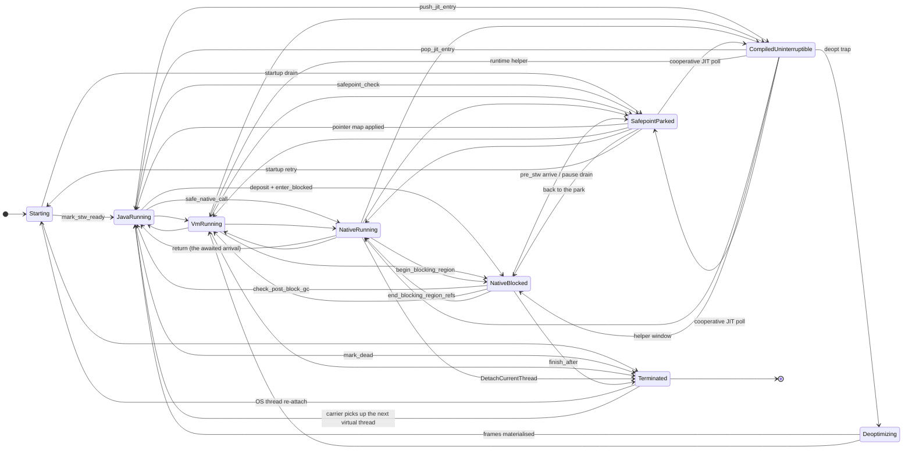

# Thread transition states

*Implements report item **P1** — "Introduce explicit
runtime transition states" — and supplies the state vocabulary the P0 items
"Model safepoint arrival and cancellation" and "Make JIT-frame registration
atomic with Java-frame visibility" need.*

Code: [`vm/src/threading/thread_state.rs`](../../vm/src/threading/thread_state.rs).
Companion: [`objectref-concurrency-contract.md`](objectref-concurrency-contract.md),
whose §1.1 four-way mutator census this document turns into a checked machine.

> **Line numbers.** References into `vm/src/threading/gc_barrier.rs` and
> `vm/src/threading/thread_registry.rs` are **post**-instrumentation (this
> change edits both). Every other reference is as audited against `dev`
> at `d18501d83`.

---

## 1. What this change is, and what it is not

**Is:** a `ThreadExecState` enum, a legal-transition table derived from the
audit in §2, a shadow recorder that each state-changing site calls, a
debug/stress-gated legality tripwire, and `thread_state_census()` — one
per-state population count for the safepoint code and a future JFR event to
share.

**Is not:** a change to how threads park, block or arrive. The existing flags
and counters stay **authoritative**. `record_transition` performs one relaxed
store into a per-thread cell; nothing reads the shadow state to make a
decision. §7 lists what must become authoritative next, and in what order.

The reason for that split is in the barrier's own comments
(`gc_barrier.rs:69-91`): guessing a thread's participation status from any one
of these flags is what produced the MTChurn lost-increment / BinaryTrees
wrong-total / ES IVF-KNN corruption family. A shadow record can be wrong
without corrupting anything; an authoritative one cannot.

---

## 2. Audit — what encodes a thread's execution state today

Nine independent pieces of state, no two of them updated under a common lock,
and none of them a state machine.

| # | Encoding | Declared | Set by | Read by | Ordering |
|---|---|---|---|---|---|
| 1 | `ThreadEntry::alive: AtomicBool` | `thread_registry.rs:126` | `register_with_daemon_stw_ready` (`:399`, `true`); `mark_dead` (`:820`, `false`) | `is_alive` (`:961`), every census (`:1981`, `:2044`, `:2073`), `collect_all_root_snapshots` (`:1660`), `frozen_peer_thread_addrs` (`:488`), TLAB-tail collect (`:524`) | `Release` store / `Acquire` load |
| 2 | `ThreadEntry::stw_ready: AtomicBool` | `thread_registry.rs:133` | `register_starting_with_daemon` (`false`, `:400`); `mark_stw_ready` (`:971`) | `alive_count_and_os_tids` (`:1981`), `alive_count_blocked_and_os_tids` (`:2044`), `alive_thread_ids_excluding` (`:2073`) | `Release` / `Acquire` |
| 3 | `GcBlockState::in_blocked_region: AtomicBool` | `jvm_thread.rs:116` | `deposit_root_snapshot_inner` raise (`vm_exec.rs:3604-3609`); `leave_blocked_region_flagged` clear (`gc_barrier.rs:491`); bare stores at `vm_exec.rs:2812`, `jni.rs:756`, `jni.rs:1019` | identity census `alive_count_blocked_and_os_tids_inner` (`thread_registry.rs:2057`), `fold_pointer_map_into_blocked` (`:1844`), `blocked_thread_os_tids` (`:1480`), `safepoint_check` tripwire (`interpreter.rs:4231-4241`) | `Release` / `Acquire`. **No relationship to #4.** |
| 4 | `GcBarrier::threads_blocked: AtomicU64` | `gc_barrier.rs:52` | `enter_blocked` (`:311`), `mark_blocked_region_enter` (`:345`) `+1`; `mark_blocked_region_leave_after` (`:387`), `BlockedGuard::drop` (`:838`) `-1` | `request_stw_counted_locked` (`:210`, legacy path only), `blocked_count()` (`:469`) | `AcqRel` RMW under `inner` lock |
| 5 | `GcBarrierInner::{expected, arrived}` | `gc_barrier.rs:64-66` | `request_stw_counted_locked` (`:210`); `arrive_and_wait_inner` (`:672`); `leave_blocked_region_flagged` (`:491`); `reduce_expected` (`:587`) | `wait_for_all` (`:553`), `wait_for_all_timeout` (`:568`), `pending_count` (`:722`) | plain fields under `inner: Mutex` |
| 6 | `GcBarrierInner::excluded_blocked: HashSet<u64>` | `gc_barrier.rs:91` | `request_stw_counted_locked` (`:210`); cleared by `complete_gc` (`:602`) | `arrive_and_wait_inner` when `mode == None` (`:672`), `leave_blocked_region_flagged` (`:491`) | under the same `inner: Mutex` — the *point* of the GCAUDIT-0711 fix |
| 7 | `GcBarrier::stw_requested: AtomicBool` + `gc_generation: AtomicU64` | `gc_barrier.rs:26,29` | `request_stw_counted_locked` / `complete_gc` | `safepoint_check` (`interpreter.rs:4298`), every arrival, and JIT-baked polls via `stw_requested_flag_addr` (`gc_barrier.rs:121`) | `Release` store / `Acquire` load |
| 8 | `GLOBAL_JIT_DEPTH: AtomicUsize` + thread-local `JIT_ENTRY_CHAIN` | `jit/conservative_roots.rs:332`, `:166` | `push_entry_full` (`:608`), `pop_jit_entry` (`:652`), `prune_returned_jit_entries` (`:701`) — each mirrored into `cratonvm_jit::jit_execution_enter/leave` and `gc_quiescence::enter/leave` | `any_thread_in_jit` (`:2097`), `other_thread_in_jit` (`:2048`), `current_thread_jit_depth` (`:2104`), `refresh_moving_young_coverage_for_collection` (`:2081`) | `Release` RMW / `Acquire` load; the chain is thread-local (`RefCell`) |
| 9 | `JIT_SIGNALS.deopt` (thread-local `Cell<bool>`) | `jit/helpers.rs:850` | `set_jit_deopt_pending` (`:850`), `jit_set_deopt_pending` (`:874`), `jit_service_callee_deopt` (`:2192`) | `take_jit_deopt_pending` (`:860`) at the interpreter's post-invoke check | thread-local, no ordering |

Two further pieces are *observability only* and were checked but not modelled:
`GcBlockState::java_state: AtomicU8` (`jvm_thread.rs:121`; 1 = WAITING,
2 = BLOCKED, 3 = TIMED_WAITING — feeds `Thread.getState()` only), and
`JvmThread::vm_state: Arc<Mutex<String>>` (`jvm_thread.rs:634`, opt-in under
`CRATONVM_DBG_VM_STATE`) — the only existing approximation of `VmRunning`.

### 2.1 What the audit shows

* **Two blocked censuses that can disagree.** #3 (identity) and #4
  (anonymous) are set by different call sites with no ordering between them.
  Production keys `expected` off #3
  (`request_stw_counted_with_live_blocked` → `alive_count_blocked_and_os_tids`,
  `interpreter.rs:1397`); the legacy path keys it off #4. See §6 item 1.
* **No `VmRunning` and no `Deoptimizing` exist at all.** A thread in a runtime
  helper or materialising deopt frames is indistinguishable from one executing
  bytecode, yet its rooting rule is strictly weaker (raw `ObjectRef`s in Rust
  locals, which no pointer map rewrites).
* **`CompiledUninterruptible` is only visible as a process-global count.**
  `any_thread_in_jit()` collapses every thread to one bool; the per-thread
  chain is thread-local and unreadable by a peer. The STW census cannot see it
  at all, which is why the quota is repaired *after the fact* by
  `reduce_expected` (§6 item 2).
* **Termination is not always self-attributed.** `ThreadRegistry::join`
  (`thread_registry.rs:995`) calls `mark_dead(joinee)` from the *joining*
  thread.

---

## 3. The state machine

Self-edges (`s -> s`) are legal and not drawn: nested blocking regions share
one `in_blocked_region` flag and a nested JIT entry only deepens
`GLOBAL_JIT_DEPTH`, so re-recording the same state is a counting event, not a
state change.

**The first record on a thread seeds rather than transitions.** The recorder
cannot know what a thread was doing before it was first observed, so
`with_cell` establishes a baseline instead of checking against an invented
`Starting`.

---

## 4. Transition table with evidence

Every edge below is one the code performs. Edges the code performs that look
*wrong* are in §6, not here — the tripwire must report them, not bless them.

| From | To | Site | Evidence |
|---|---|---|---|
| `Starting` | `JavaRunning` | `mark_stw_ready` under `run_if_no_stw_requested` | `thread_registry.rs:971`; `vm_exec.rs:2754`, `:10195`; barrier serialization `gc_barrier.rs:284` |
| `Starting` | `SafepointParked` | startup retry loop drains an already-active pause | `vm_exec.rs:2760`, `:10201` (`arrive_and_wait_excluded`) |
| `Starting` | `Terminated` | carrier fails before becoming ready | `jni.rs:568`; `thread_registry.rs:811` |
| `JavaRunning` | `VmRunning` | any runtime helper entry (alloc slow path, resolution, reflection) | **not flagged today** — only `vm_state` breadcrumbs (`jvm_thread.rs:634`) approximate it |
| `JavaRunning` | `NativeRunning` | `safe_native_call` | `vm_exec.rs:1296`, `:1318` |
| `JavaRunning` | `NativeBlocked` | `deposit_root_snapshot` raises the flag, then `enter_blocked` / `mark_blocked_region_enter` | `vm_exec.rs:3220`, `:3604-3609`, `:14238`; `gc_barrier.rs:311`, `:345` |
| `JavaRunning` | `SafepointParked` | `safepoint_check` observes `stw_requested`, publishes roots, arrives | `interpreter.rs:4298`, `:4331`, `:4341` |
| `JavaRunning` | `CompiledUninterruptible` | `push_jit_entry` / `push_entry_full` | `jit/conservative_roots.rs:608-637` |
| `JavaRunning` | `Terminated` | `mark_dead` | `thread_registry.rs:811`; `vm_exec.rs:2961`; `jni.rs:568` |
| `VmRunning` | `JavaRunning` | helper returns | — |
| `VmRunning` | `NativeRunning` / `NativeBlocked` / `SafepointParked` / `Terminated` | same sites as from `JavaRunning`; VM helpers poll at allocation sites | `interpreter.rs:4298` |
| `VmRunning` | `CompiledUninterruptible` | `JitEntryGuard::enter_with_compiled` from a helper | `jit/conservative_roots.rs:608` |
| `NativeRunning` | `JavaRunning` | native returns to the interpreter — **this is the arrival the census deliberately waits for** | `gc_barrier.rs:44-47` |
| `NativeRunning` | `NativeBlocked` | `begin_blocking_region` / `begin_timed_blocking_region` | `vm_exec.rs:11326`, `:11330`, `:14238` |
| `NativeRunning` | `SafepointParked` | a native that re-enters Java and hits the poll | `interpreter.rs:4298` |
| `NativeRunning` | `CompiledUninterruptible` | native callback re-entering Java into compiled code | `jit/conservative_roots.rs:608` |
| `NativeRunning` | `Terminated` | `DetachCurrentThread` | `jni.rs:6756` |
| `NativeBlocked` | `JavaRunning` | `end_blocking_region` → `check_post_block_gc` → `leave_blocked_region_flagged` clears the flag under the barrier lock | `vm_exec.rs:11334`, `:3636-3669`; `gc_barrier.rs:491` |
| `NativeBlocked` | `NativeRunning` | `end_blocking_region_refs` returns into a still-running poll loop | `vm_exec.rs:11341` |
| `NativeBlocked` | `SafepointParked` | (a) `enter_blocked().pre_stw` → arrive *before* parking; (b) drain an active pause while still counted blocked | (a) `vm_exec.rs:2126-2136`, `:9740-9767`, `:14263-14273`, `jni.rs:623-634`, `:1019-1032`; (b) `gc_barrier.rs:425` (`wait_out_pause_locked`), `:491`, `:838` |
| `NativeBlocked` | `Terminated` | `BlockedGuard::finish_after` flips `alive=false` and releases the blocked slot as one observation | `gc_barrier.rs:829`, `:387`; `vm_exec.rs:2957-2965`; `jni.rs:785`, `:6753` |
| `SafepointParked` | `JavaRunning` | `arrive_and_wait_inner` returns; `apply_pointer_map_to_thread` | `gc_barrier.rs:672`; `interpreter.rs:4341-4356` |
| `SafepointParked` | `NativeBlocked` | the blocked thread that drained a pause goes back to being blocked | `gc_barrier.rs:425`, `:491`, `:838` |
| `SafepointParked` | `Starting` | startup retry loop re-attempts `mark_stw_ready` | `vm_exec.rs:2752-2768`, `:10193-10209` |
| `SafepointParked` | `CompiledUninterruptible` | cooperative JIT poll returns into compiled code (`CRATONVM_JIT_SAFEPOINT_POLLS`) | `gc_barrier.rs:95-123` |
| `CompiledUninterruptible` | `JavaRunning` | `pop_jit_entry`; also the self-healing `prune_returned_jit_entries` | `jit/conservative_roots.rs:652-671`, `:701-750` |
| `CompiledUninterruptible` | `VmRunning` | compiled frame calls a Rust runtime helper (chain depth stays elevated — see §6 item 2) | `jit/helpers.rs` |
| `CompiledUninterruptible` | `NativeBlocked` | compiled frame calls a native that blocks — the A4 "helper window" | `jit/xt_root_scan.rs` helper-window scan |
| `CompiledUninterruptible` | `SafepointParked` | cooperative JIT poll | `gc_barrier.rs:95-123` |
| `CompiledUninterruptible` | `Deoptimizing` | deopt trap raises the out-of-band signal | `jit/helpers.rs:850`, `:874`, `:2192` |
| `Deoptimizing` | `JavaRunning` | frames materialised, interpreter resumes | `interpreter.rs:13290` (`resume_from_ir_deopt`), `:14142` (`real_frame_deopt_resume_and_despeculate`) |
| `Terminated` | `Starting` | the same OS thread re-attaching after a detach | `jni.rs::attach_foreign_thread` |
| `Terminated` | **anything** | the cell's LOGICAL thread died; the OS thread it belongs to did not — see below | `thread_registry.rs::mark_stw_ready`, `gc_barrier.rs::leave_blocked_region_flagged` |

### `Terminated` is a state of the CELL, not of the OS thread

The shadow record is one cell per OS thread, and the states in it belong to a
**logical** thread. Those are the same object only for platform threads. A
carrier multiplexes virtual threads: when one dies, `mark_dead` records
`Terminated` on the **carrier's** cell, and the carrier then picks up the next
continuation and records whatever that one is doing.

Measured 2026-09-11, one `VthreadProbe` run — 10 000 virtual threads, debug
binary, `CRATONVM_STRESS_THREAD_STATES` at its `cfg!(debug_assertions)`
default:

| count | edge | site |
|---|---|---|
| 8314 | `Terminated -> JavaRunning` | `gc_barrier::leave_blocked_region_flagged` |
| 1667 | `Terminated -> JavaRunning` | `thread_registry::mark_stw_ready` |
| 3 | `Terminated -> SafepointParked` | `gc_barrier::leave_blocked_region_flagged:drain` |
| 2 | `Terminated -> SafepointParked` | `gc_barrier::arrive_and_wait_inner:excluded` |
| 2 | `SafepointParked -> Terminated` | `gc_barrier::arrive_and_wait_inner:resume` |

9 986 reports, one per virtual thread, 4.2 MB of `tracing::error!` on a probe
whose real output is 759 bytes — and, with `CRATONVM_STRESS_THREAD_STATES=1`,
9 986 **panics**: all eight carriers died and the VM wedged waiting for
mutators that were gone. The stress mode was unusable on any virtual-thread
workload.

`is_legal` now returns `true` for every edge out of `Terminated`.
`try_record_transition` had always called `revive_current_cell()` for
`from == Terminated`, so revival was already a modelled concept; only the
legality check had not been told about it. The `Terminated -> Starting` row
above stays because it is the one such edge with a named call site.

What this gives up: a genuinely resurrected thread recorded on the same cell
now reads as a revival. The record cannot tell the two apart — under M:N the
cell is the carrier's and the identity is the continuation's — so the choice
was between missing that and reporting every virtual thread in the process.
The last row of the table above is untouched by the change and still reports.

Deliberately **absent** (asserted as illegal in the tests):

* `SafepointParked -> Terminated` and `CompiledUninterruptible -> Terminated` —
  a parked thread must resume, and a JIT entry chain must unwind, before any
  teardown runs.
* `* -> Deoptimizing` from anything but `CompiledUninterruptible` — deopt
  materialisation is entered only from compiled code.
* `NativeBlocked -> CompiledUninterruptible` — the blocked region must be left
  (and its fixup applied) first, or the JIT frame resumes on vacated addresses.
* ~~`Terminated -> *` except `Starting`~~ — **withdrawn 2026-09-11.** The test
  that asserted it (`representative_illegal_transitions_are_rejected`, "a dead
  thread must not resume as {to}") was wrong about what a cell in `Terminated`
  means. See the section above.
* `Starting -> {VmRunning, NativeRunning, NativeBlocked, CompiledUninterruptible}` —
  a not-yet-`stw_ready` carrier runs no natives and no compiled code.

---

## 5. Per-state rules

`Quota` = counted in `expected` by
`alive_count_blocked_and_os_tids` (`thread_registry.rs:2057`).
`Unrewritable refs` = the thread may hold raw `ObjectRef`s that **no**
pointer-map consumer rewrites.
`Relocation` = what a moving collector may do while a thread sits here.

| State | Quota | Unrewritable refs | Relocation | Why |
|---|---|---|---|---|
| `Starting` | **no** | no | permitted, with rewrite | `stw_ready == false` excludes it; the startup loop waits the pause out via `arrive_and_wait_excluded` and applies the returned map (`vm_exec.rs:2760-2767`) |
| `JavaRunning` | yes | no | **forbidden** | refs live in frame slots / operand stacks — rewritable, but only once the thread has actually parked. Relocating *while* it runs is finding-1's corruption family |
| `VmRunning` | yes | **yes** | **forbidden** | a Rust local holding an `ObjectRef` across a safepoint is not rewritten (`objectref-concurrency-contract.md` §5, §7 item 2) |
| `NativeRunning` | yes | **yes** | **forbidden** | "a *running* native still holds raw `ObjectRef`s in Rust locals and must be waited for" (`gc_barrier.rs:44-47`) |
| `NativeBlocked` | **no** | no | permitted, with rewrite | deposited snapshot + `fold_pointer_map_into_blocked` (`thread_registry.rs:1844`) + `check_post_block_gc` (`vm_exec.rs:3636`) + `slot_origins` write-back |
| `SafepointParked` | yes (slot already filled) | no | permitted, with rewrite | `apply_pointer_map_to_thread` rewrites frames, operand stacks, `monitor_on_exit`, JNI locals, handle slots (`interpreter.rs:4394`) |
| `CompiledUninterruptible` | yes (**optimistically** — see §6.2) | **yes** | **forbidden** | registers and JIT spill slots are unrewritable; each contributing pass must call `gc_quiescence::mark_moving_young_coverage_incomplete_because` or pin the peer's G1 regions (`xt_root_scan.rs:46-70`, `interpreter.rs:1444`) |
| `Deoptimizing` | yes | **yes** | **forbidden** | in-flight `FrameValue` buffers are in neither the compiled frame's map nor the not-yet-built interpreter frame |
| `Terminated` | **no** | no | permitted, nothing to rewrite | `alive == false`; the entry survives only for `getState()` answers |

`ThreadExecState::may_hold_unrewritable_object_refs()` and
`relocation_rule()` encode these two columns, and a test asserts they cannot
drift apart: **every state that may hold unrewritable refs must forbid
relocation.**

---

## 6. Transitions the code performs that look unsound or unmodelled

These are *findings*, not blessed edges. They are the reason the table above
is derived rather than declared.

### 6.1 `host_thread_enter_native` desynchronises the two blocked censuses

`jni::host_thread_enter_native` (`vm/src/native/jni.rs:614-636`) calls
`GcBarrier::mark_blocked_region_enter()` — bumping the **anonymous** counter
(#4) — **without** a `deposit_root_snapshot` and therefore **without** raising
`in_blocked_region` (#3). Its own doc calls itself "the host-facing analog of
HotSpot's `_thread_in_native`".

Production STW keys `expected` off #3, not #4
(`interpreter.rs:1397` → `alive_count_blocked_and_os_tids`). So a registered,
`stw_ready` thread that declares itself host-native is **still counted in
`expected`** while sitting in a host `join()`/event loop it will not leave —
exactly the hang the function exists to prevent. It is not caught today
because the only test for it (`jni.rs:7211`) uses the legacy
`request_stw(initiator, alive)` path, which subtracts #4.

Symmetrically, `host_thread_leave_native` (`:642`) calls only
`mark_blocked_region_leave()` — it never clears an identity flag, and never
applies a blocked-window fixup — so a host thread that *was* correctly
excluded would resume on stale addresses.

*Shadow behaviour:* the recorder follows #4 here (the superset), so such a
thread shows as `NativeBlocked` and stays there until its next barrier
interaction. That divergence from the identity census is itself the signal.

*Fix direction:* either raise `in_blocked_region` (with a deposit) in
`host_thread_enter_native` and clear it via `leave_blocked_region_flagged`, or
drop the function in favour of the `begin_blocking_region` discipline every
other blocking site uses.

### 6.2 `CompiledUninterruptible` is counted, then un-counted

The census cannot see that a thread is in compiled code, so such a thread is
counted in `expected` and then removed after the fact by `reduce_expected`
once the OS-level takeover has frozen it (`gc_barrier.rs:587`;
`jit/xt_root_scan.rs`). Two consequences:

1. Between `request_stw` and the takeover pass, `wait_for_all` is waiting for
   a thread that will never arrive. The bounded `wait_for_all_timeout` loop
   (`gc_barrier.rs:568`) exists solely to survive this.
2. `xt_root_scan` classifies a peer by its `Rip`, while
   `GLOBAL_JIT_DEPTH` classifies it by chain depth. **They disagree for a
   compiled frame that has called a Rust helper**: `Rip` is outside the JIT
   range (so the takeover resumes it and expects a cooperative arrival) while
   the depth is still elevated (so `any_thread_in_jit()` still forbids
   relocation). The A4 helper-window scan patches the root-coverage half of
   this; the *arrival* half is still two answers to one question.

This is the P0 item "Make JIT-frame registration atomic with Java-frame
visibility" seen from the census side: until entering compiled code and
becoming census-visible-as-in-JIT are one step, the quota cannot be right at
`request_stw` time.

### 6.3 The virtual-thread first-mount bare flag store

`vm_exec.rs:2812` clears `in_blocked_region` with a raw
`store(false, Release)` rather than `leave_blocked_region_flagged`. Its
comment argues it is safe because that arm is the *first* mount, whose
`GcBlockState` is virgin (flag already down, fixup empty) — i.e. the store is
a no-op. That reasoning holds, but it is exactly the pattern the finding-1(c)
fix removed everywhere else, and nothing enforces the "virgin" precondition.
Modelled here as no transition at all; if the precondition ever breaks, the
tripwire will not see it either. Recommend a `debug_assert!` that the flag was
already `false`.

### 6.4 `mark_dead` is not always self-attributed

`ThreadRegistry::join` (`thread_registry.rs:995`) marks the *joinee* dead from
the *joining* thread. The shadow recorder therefore uses
`record_transition_for(tid, …)`, which records only when the calling thread's
cell is bound to that id — a peer's termination is never attributed to the
caller. The cost is that a thread reaped purely via `join` never records
`Terminated` itself; its cell is reclaimed by the TLS destructor
(`CellHandle::drop`) instead, which keeps the census registry O(live OS
threads) under Tomcat-style thread churn.

### 6.5 `VmRunning` and `Deoptimizing` have no production encoding at all

Neither state exists outside this module. A thread inside a class-resolution
helper is indistinguishable from one executing bytecode, and one materialising
deopt frames is indistinguishable from one in compiled code — despite both
having strictly weaker rooting rules than the state they are conflated with
(§5). This is unmodelled rather than unsound today, because both are covered
by the blanket "a running mutator is waited for" rule; it becomes unsound the
moment anything tries to relocate under a counted-but-not-yet-arrived thread.

---

## 7. Instrumented sites, and what is still unwired

### 7.1 Wired in this pass

All in `vm/src/threading/`:

| Site | Records | Notes |
|---|---|---|
| `GcBarrier::enter_blocked` (`gc_barrier.rs:311`) | `NativeBlocked` | after the `inner` lock drops |
| `GcBarrier::mark_blocked_region_enter` (`:345`) | `NativeBlocked` | follows the anonymous counter — see §6.1 |
| `GcBarrier::wait_out_pause_locked` (`:425`) | `SafepointParked`, then restores the caller's prior state | covers `BlockedGuard::drop` and `mark_blocked_region_leave_after` |
| `GcBarrier::leave_blocked_region_flagged` (`:491`) | binds the thread id; `SafepointParked`/`NativeBlocked` around each drain; `JavaRunning` on the authoritative flag clear | |
| `GcBarrier::arrive_and_wait_inner` (`:672`) | binds the thread id; `SafepointParked`, then restores the caller's prior state | the primary binding point |
| `ThreadRegistry::mark_stw_ready` (`thread_registry.rs:971`) | binds the thread id; `JavaRunning` | the `Starting -> JavaRunning` edge |
| `ThreadRegistry::mark_dead` (`:811`) | `Terminated`, self-attributed only | see §6.4 |

The barrier chokepoints were chosen deliberately: every blocking-region entry,
every arrival and every pause drain in the VM funnels through them, so this
covers `Starting`, `JavaRunning`, `NativeBlocked`, `SafepointParked` and
`Terminated` without touching a single hot interpreter path.

Recording an approximate state cannot cascade into a false violation, because
the approximations are chosen to land on states whose onward edges are
supersets. `leave_blocked_region_flagged` records `JavaRunning` even for a
caller resuming inside a native; that caller records `NativeRunning` at its
next transition, and `JavaRunning -> NativeRunning` is itself tabled.

### 7.2 Not wired — call sites outside this change's file ownership

These need a one-line `thread_state::record_transition(...)` each. They are
listed with the exact insertion point so the follow-up is mechanical:

| State | Insertion point |
|---|---|
| `CompiledUninterruptible` | `jit/conservative_roots.rs::push_entry_full` (`:608`, after `GLOBAL_JIT_DEPTH.fetch_add`) and `::pop_jit_entry` (`:652`, in the `Some(entry)` arm) — plus `prune_returned_jit_entries` (`:701`) for the self-heal |
| `Deoptimizing` | `jit/helpers.rs::set_jit_deopt_pending` (`:850`) on entry; `runtime/interpreter.rs::resume_from_ir_deopt` (`:13290`) and `::real_frame_deopt_resume_and_despeculate` (`:14142`) on exit |
| `NativeRunning` | `vm/vm_exec.rs::safe_native_call_impl` (`:1318`) — record on entry, restore the prior state on return |
| `VmRunning` | wherever `JvmThread::set_vm_state` breadcrumbs are already emitted (`jvm_thread.rs:636`), which is the existing (opt-in) approximation |

Until they are wired, the census reports those threads in whatever state they
last recorded — `JavaRunning` for a thread that has entered compiled code, for
instance. That is a *reporting* gap only; nothing consumes the shadow state.

---

## 8. The tripwire

`record_transition(to, site)`:

1. one relaxed load of the thread's cell,
2. if armed, a scan of `TRANSITIONS` for `(from, to)`,
3. one relaxed store.

**When the check runs:** `debug_assertions` builds, or any build with
`CRATONVM_STRESS_THREAD_STATES` set. Setting it to `0`/`false`/`off` stands it
down even in debug — the bisection escape hatch for the case where *the table*
turns out to be wrong rather than the code.

**When it panics:** only when the env gate is explicitly armed. A debug build
counts (`illegal_transition_count()`) and `tracing::error!`s instead. This is a
deliberate softening of the report's "fail in debug/stress builds": the table
is derived from a read of the code, and a derivation error must not be able to
abort an otherwise-passing debug run on its first day. Flip the default once a
full suite pass reports zero violations.

The message names both states, the bound thread id, the call site, and the
legal successors of `from`.

The store lands **even on a violation** — the shadow record must keep tracking
reality, or one bad edge desynchronises every later check.

---

## 9. What must become authoritative next

In dependency order:

1. **Make the state word the exclusion set.** Replace
   `alive_count_blocked_and_os_tids`'s `in_blocked_region` read
   (`thread_registry.rs:2057`) with a `thread_state_census()`-derived
   identity set. This is the P0 "Model safepoint arrival and cancellation"
   item's prerequisite: `excluded_blocked` becomes a projection of the state
   machine rather than a parallel snapshot.
2. **Fix §6.1 first**, or step 1 changes behaviour: the shadow follows the
   anonymous counter for `host_thread_enter_native`, the identity census does
   not, and making the state authoritative would silently start excluding
   those threads.
3. **Make entering compiled code census-visible** (§6.2). Until then
   `counts_toward_safepoint_quota()` must keep answering `true` for
   `CompiledUninterruptible` and `reduce_expected` must keep existing.
4. **Retire the redundant encodings.** In order: `threads_blocked` (#4,
   subsumed by the census), then `stw_ready` (#2, becomes
   `state != Starting`), then `in_blocked_region` (#3, becomes
   `state == NativeBlocked`). `alive` (#1) is last because `getState()`
   semantics for a dead thread depend on the entry outliving the carrier.
5. **Emit a JFR event** from `thread_state_census()` / `thread_state_roster()`
   so a hang report names each thread's state instead of reconstructing it
   from `CRATONVM_DBG_STW_CENSUS` prints.

Until step 1 lands, `docs/known-issues/` triage should treat a shadow/real
disagreement as a *reporting* discrepancy, not a correctness one — the shadow
is not in the decision path.

---

## 10. Census reconciliation

This section records the follow-up pass that acted on §6.1, §6.3 and §7.2. It
does not restate them; it says which findings survived verification, what
changed, and what is deliberately still open.

### 10.1 §6.1 was real — and the VM already had a tripwire for its shape

Verified against `dev` at `d18501d83`:

* `jni::host_thread_enter_native` bumped `GcBarrier::threads_blocked` (#4) and
  nothing else. It never raised `in_blocked_region` (#3).
* Production keys `expected` off #3 only
  (`interpreter.rs` → `request_stw_counted_with_live_blocked` →
  `alive_count_blocked_and_os_tids`). #4 is read solely by the legacy
  `request_stw` path.
* The only test for it (`jni.rs::host_native_excludes_idle_thread_from_stw`)
  drives that legacy path, so the identity census was never exercised.

The decisive corroboration is in the VM itself: `stw_take_over_and_wait`
(`runtime/interpreter.rs`) carries an **always-on** `[gcbarrier-tripwire]` that
fires after 64 stuck takeover rounds and prints, verbatim, "a thread called
`GcBarrier::enter_blocked()`/`mark_blocked_region_enter()` **WITHOUT** first
depositing a root snapshot, so it is invisible to the production STW census but
still occupies an `expected` slot no arrival can ever satisfy". That tripwire
was added for a *different* call site with this exact shape;
`host_thread_enter_native` was the remaining instance of it.

**Fix.** Both halves now use the sequence `VmNativeThreadBlocker`
(`vm/src/vm/vm_exec.rs`) already uses for VM-registered native carrier threads —
i.e. the existing mechanism, not a new one:

| | before | after |
|---|---|---|
| `host_thread_enter_native` | `mark_blocked_region_enter` (+ `arrive_and_wait_auto` if `pre_stw`) | `ThreadRegistry::mark_native_thread_blocked` **then** the same two steps |
| `host_thread_leave_native` | `mark_blocked_region_leave` | `mark_blocked_region_leave`, then `GcBarrier::leave_blocked_region_flagged`, then `mark_native_thread_unblocked` for the side-table drain |

The identity flag is raised *before* the counter and cleared *after* it, which
is the ordering every other blocking site uses (`deposit_root_snapshot` →
`enter_blocked`; `mark_blocked_region_leave` → `check_post_block_gc`). Either
side of the race is then handled by machinery that already exists: a census
serialized before the raise counts the thread and `arrive_and_wait_auto`
supplies the arrival it waits for; a census serialized after excludes it, and
`auto` resolves that from the pause's own `excluded_blocked` snapshot rather
than guessing.

**Naming the caller.** A host thread parked outside the VM has no `&mut
JvmThread` and no `JNI_THREAD` binding — `with_jni_context` returns `None` on
the creating thread by construction (`libcratonvm`'s own soak comments say so),
so `deposit_root_snapshot` is unreachable from there. The identity link that
*does* survive leaving the VM is the published `os_tid`, so the fix adds
`ThreadRegistry::thread_id_for_current_os_tid()`. It answers `None` — falling
back to exactly the pre-fix counter-only behaviour — when the calling OS thread
is in no alive entry (then it is absent from `alive_count` too, so it occupies
no `expected` slot and needs no exclusion), when *more than one* alive entry
claims it (a mounted virtual thread republishes its carrier's `os_tid`; see
10.5), or on a platform with no `os_tid` backend.

**Residual, deliberately accepted.** `mark_native_thread_blocked` empties the
published root snapshot, because the primitive's stated contract is that the
caller holds no live Java roots while parked. That is safe for the intended
caller (its `java.lang.Thread` mirror is a strong root of every alive registry
entry — `memory/roots.rs` step 10b — and it owns no interpreter frames between
`vm.invoke` calls), and it is the same trade the pre-existing native-carrier
path takes. It does change the *misuse* failure mode: a caller that declares
itself host-native while holding live Java roots used to hang, and now loses
those roots silently. `CRATONVM_DBG_BLOCKGC` reports the tell (a non-empty
discarded fixup at leave). Closing this properly means depositing through the
registry-published `jvm_thread_addr`, which requires proving the caller is not
simultaneously inside an interpreter `&mut JvmThread` borrow — not provable at
that entry point today.

**Test.** `jni.rs::host_native_excludes_idle_thread_from_the_identity_census`
is the identity-path twin of the existing legacy-path test (which stays). It
drives `alive_count_blocked_and_os_tids` +
`request_stw_counted_with_live_blocked` — the production pair — and asserts the
host-native thread is in `blocked_tids`, that `pending_count()` is 0, and that
leaving clears the identity flag again. Without the fix it observes
`blocked == 0`, `expected == 1`, `pending_count() == 1`.

### 10.2 §6.3 — the bare flag stores

Enumerated every `in_blocked_region` write in `vm/src/`:

* `vm_exec.rs` (virtual-thread first mount) — the only bare `store(false)` on
  a `JvmThread`'s own flag. The "virgin state" argument holds; it is now
  pinned by two `debug_assert!`s (flag already down, `fixup` empty) that name
  `check_post_block_gc` as the correct handler if it ever breaks.
* `ThreadRegistry::mark_native_thread_unblocked` — the *other* bare
  `store(false)`, and the one the audit did not name. Its caller
  (`VmNativeThreadBlocker::leave_blocked`) waits out only the pause active at
  `mark_blocked_region_leave`; a pause requested between that and the store
  both excludes the thread and lets it run — finding 1(c) exactly. Both
  callers (that one and the new `host_thread_leave_native`) now clear through
  `leave_blocked_region_flagged` first and keep the registry call purely for
  its side-table drain, where its store is a no-op.
* `jni.rs:756` / `jni.rs:1019`, flagged by an earlier pass, are **not** this
  bug: both are `store(true)` (raises), not bypassed clears. The second is
  additionally redundant — the `deposit_root_snapshot()` on the line above
  already raises the flag — but harmless, and left alone.

### 10.3 §7.2 — the unwired states

`CompiledUninterruptible`, `Deoptimizing` and `NativeRunning` are now recorded:

| State | Site |
|---|---|
| `CompiledUninterruptible` | `conservative_roots::push_entry_full` (after the `GLOBAL_JIT_DEPTH` bump) |
| → leave | `pop_jit_entry` and `prune_returned_jit_entries`, via `leaving_compiled_state(remaining)` |
| `Deoptimizing` | `jit/helpers.rs::set_jit_deopt_pending` |
| → leave | `interpreter::resume_from_ir_deopt` and `::real_frame_deopt_resume_and_despeculate` (resumed path only) |
| `NativeRunning` | `vm_exec::safe_native_call_impl`, restored to the caller's prior state by a `Drop` guard |

Two modelling choices are load-bearing, because the table is settled and a
wiring pass must not manufacture edges the code does not perform:

1. **Leaving compiled code with entries remaining.** `pop_jit_entry` records
   `CompiledUninterruptible` again (a legal self-edge) unless the chain is now
   empty, in which case it records `JavaRunning`. But if the thread is
   `Deoptimizing`, it records `JavaRunning` regardless: `Deoptimizing`'s only
   tabled successors are `JavaRunning`/`VmRunning`, so re-recording
   `CompiledUninterruptible` for a nested pop would report a violation the code
   is not committing. The consequence is that the shadow `Deoptimizing` window
   usually ends at the pop rather than at frame materialisation; the two
   interpreter resume sites are then no-op self-edges that exist to close the
   window on any deopt path with no intervening pop.
2. **Restoring after a native.** `current_state()` answers `Starting` both for
   "not yet STW-ready" and for "never observed", and this funnel is often a
   carrier's first record. Restoring `Starting` would assert the one thing the
   table denies of a thread that just ran a native (`Starting -> NativeRunning`
   is deliberately absent) and would repeat on every later native call, so the
   guard resumes such a thread as `JavaRunning`.

**Cost note.** `safe_native_call_impl` and `push_entry_full`/`pop_jit_entry`
are hot paths, and `record_transition` is not free: `with_cell` clones an `Arc`
(two atomic RMWs) on top of the TLS access and the relaxed load/store. That is
two records per native call and two per JIT entry. If a benchmark regresses,
the cheapest remedy is to gate *these* sites (not the barrier ones) on a cached
process-global flag, which returns release builds to the §7.2 status quo — the
shadow state is still in no decision path. `VmRunning` remains unwired.

### 10.4 §6.2 in-JIT classification — real disagreement, not exploitable today

The audit's claim is factually correct: `xt_root_scan` classifies a peer by
`Rip` against the registered JIT code ranges, `GLOBAL_JIT_DEPTH` classifies by
chain depth, and for a compiled frame that has called a Rust helper the two
disagree. Both answers, however, currently fail *safe*:

* **Arrival half.** `try_take` (Windows) / the signal handler (Linux) only keep
  a peer frozen when its `Rip` is in a JIT range; anything else is resumed
  immediately and — this is the load-bearing detail — is **not** appended to
  `TakenOver::tids`. `stw_take_over_and_wait` derives `reduce_expected` solely
  from newly added tids that also appear in `counted_os_tids`, so a
  helper-window peer is never excused. It keeps its `expected` slot and the
  initiator keeps waiting. The cost is latency, not an early release: the
  takeover loop re-scans (on the `stw_takeover_should_scan` cadence) and
  freezes it on a later pass once its `Rip` is back in JIT, or it returns to
  the interpreter and arrives cooperatively.
* **Relocation half.** `refresh_moving_young_coverage_for_collection` reads
  `other_thread_in_jit()` — chain depth, which *stays elevated* across the
  helper — and marks moving-young coverage incomplete. The over-approximating
  side is the one wired to the "may I relocate?" question, which is the correct
  polarity.
* **The blocked variant is covered.** A compiled frame whose native *blocks*
  (the A4 helper window) leaves `expected` legitimately via
  `in_blocked_region`, and `helper_window_pass` — which runs after the barrier
  is satisfied and is scoped to `blocked_os_tids()` — scans it and marks
  coverage incomplete.

So there is no state today in which a thread is both excused from the barrier
and permitted to have its objects relocated on the strength of the *other*
classifier. What must change before that stays true is precise:

1. `reduce_expected` must never be driven by any classifier other than "this
   peer is frozen right now, and I froze it". Any future "excuse it, it looks
   like it is in JIT" shortcut keyed on `GLOBAL_JIT_DEPTH` reintroduces the
   early-release bug directly.
2. Conversely, if `any_thread_in_jit()` is ever narrowed to `Rip`-based
   classification (e.g. "the peer is in a helper, so its registers are Rust's
   problem"), the moving-young gate loses the helper window: the compiled
   frame's spill slots are still live and still unrewritable while the helper
   runs.
3. The real fix is the P0 item the audit names — make entering compiled code
   census-visible so `expected` is right at `request_stw` time and both
   questions read one publication. Until then the two classifiers must stay
   deliberately mismatched *in this direction*, and that intent belongs in a
   comment at both sites.

Adjacent, **unverified**, and worth its own investigation: a helper-window peer
that is waiting on a Rust lock held by a thread already parked at the safepoint
would not arrive until the pause completes, which the pause is waiting for. The
frozen-peer set cannot cause this (a peer with `Rip` in JIT provably holds no
VM lock), so it would have to come from a cooperative arrival made while
holding a VM lock. Nothing here establishes that such an arrival exists.

### 10.5 One-carrier-many-identities

`thread_id_for_current_os_tid` returns `None` on ambiguity because a mounted
virtual thread republishes its carrier's `os_tid` under the vthread's own
`ThreadId` (`vm_exec.rs`'s mount path). The same ambiguity is visible in
`stw_take_over_and_wait`'s excusal arithmetic, which reduces `expected` by a
*count* of frozen OS threads while `expected` counts registry *entries*. If two
alive, `stw_ready` entries can share one carrier, freezing that carrier excuses
one and strands the other. Not investigated here — flagged because the two
places make the same identity assumption.
